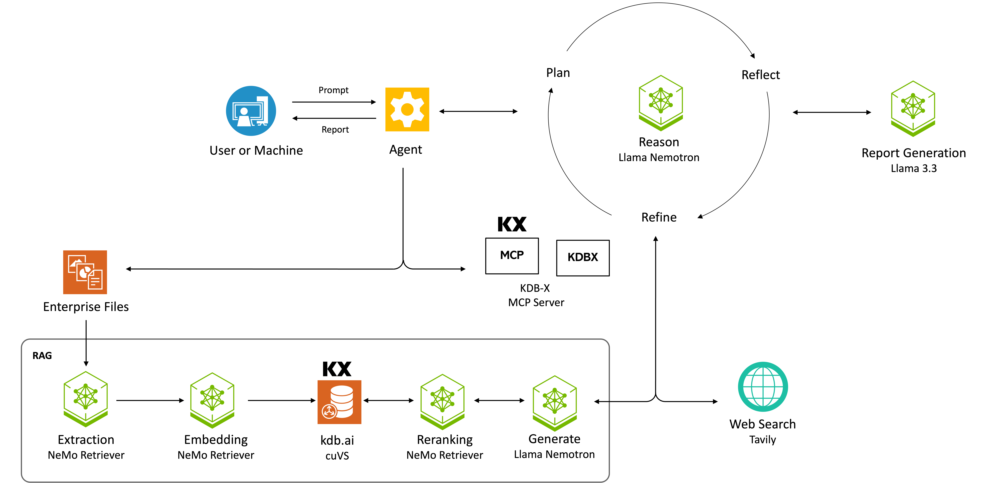

# AI-Q NVIDIA Research Assistant Blueprint

## Overview

The AI-Q NVIDIA Research Assistant blueprint allows you to create a deep research assistant that can run on-premise, allowing anyone to create detailed research reports using on-premise data and web search.

**AIQ-KX Edition**: This repository includes the **AIQ-KX** variant with KDB+ financial data integration, enabling real-time and historical time-series analysis for financial research. Pre-built Docker images are available for quick deployment.

## Table of Contents

- [AI-Q NVIDIA Research Assistant Blueprint](#ai-q-nvidia-research-assistant-blueprint)
  - [Overview](#overview)
  - [Table of Contents](#table-of-contents)
  - [Key Features](#key-features)
  - [AIQ-KX Quick Start](#aiq-kx-quick-start)
  - [Target Audience](#target-audience)
  - [Software Components](#software-components)
  - [Technical Diagram](#technical-diagram)
  - [Minimum System Requirements](#minimum-system-requirements)
    - [Disk Space](#disk-space)
    - [OS Requirements](#os-requirements)
    - [Deploy Options](#deploy-options)
    - [Drivers](#drivers)
    - [Hardware Requirements](#hardware-requirements)
      - [Docker Compose](#docker-compose)
      - [Helm](#helm)
      - [Running with hosted NVIDIA NIM Microservices](#running-with-hosted-nvidia-nim-microservices)
    - [API Keys](#api-keys)
  - [Next Steps](#next-steps)
  - [License](#license)
  - [Security Considerations](#security-considerations)

## Key Features

- **Deep Research**: Given a report topic and desired report structure, an agent (1) creates a report plan, (2) searches data sources for answers, (3) writes a report, (4) reflects on gaps in the report for further queries, (5) finishes a report with a list of sources.
- **Parallel Search**: During the research phase, multiple research questions are searched in parallel. For each query, the RAG service is consulted and an LLM-as-a-judge is used to check the relevancy of the results. If more information is needed, a fallback web search is performed. This search approach ensures internal documents are given preference over generic web results while maintaining accuracy. Performing query search in parallel allows for many data sources to be consulted in an efficient manner.
- **Human-in-the-loop**: Human feedback on the report plan, interactive report edits, and Q&A with the final report.
- **Data Sources**: Integration with the NVIDIA RAG blueprint to search multimodal documents with text, charts, and tables. Optional web search through Tavily.
- **KDB-X Financial Data Integration**: Query high-performance time-series financial data via the KDB-X MCP (Model Context Protocol) server. Supports real-time stock prices, historical data analysis, and natural language queries translated to q/SQL. See [AIQ-KX Deployment Guide](docs/aiq-kx-deployment-guide.md).
- **Demo Web Application**: Frontend web application showcasing end-to-end use of the AI-Q Research Assistant.

## AIQ-KX Quick Start

AIQ-KX is the KDB-enabled edition with pre-built Docker images for rapid deployment.

### Pre-built Images (KX Portal)

| Component | Image | Description |
|-----------|-------|-------------|
| Backend | `portal.dl.kx.com/aiq-kx-backend:1.0.1` | FastAPI research assistant service |
| Frontend | `portal.dl.kx.com/aiq-kx-frontend:1.0.1` | React web application |

> **Registry Authentication:** Images are hosted on `portal.dl.kx.com`. You need KX Portal credentials to pull them. Contact [KX Sales](https://kx.com/contact/) for access.

> **Note:** The KDB-X database and MCP server are deployed separately. See the [AIQ-KX Deployment Guide](docs/aiq-kx-deployment-guide.md) for full deployment instructions.

### Option A: Docker Compose (Single Server)

Deploy on a single server with Docker Compose. Ideal for development or when reusing existing NVIDIA RAG NIMs:

```bash
# 1. Set environment variables (add to ~/.bashrc for persistence)
export NVIDIA_API_KEY="nvapi-xxx"
export NGC_API_KEY="$NVIDIA_API_KEY"
export KDB_BEARER_TOKEN="your-kx-portal-token"      # From https://portal.kx.com
export KDB_LICENSE_B64="$(cat kc.lic | base64)"     # Your KDB license

# 2. Clone and deploy
git clone https://github.com/NVIDIA-AI-Blueprints/aiq-research-assistant.git
cd aiq-research-assistant

# If reusing existing NVIDIA RAG NIMs:
docker compose -f deploy/compose/docker-compose-kx-reuse-nim.yaml up -d

# Or for full local deployment with self-hosted NIMs:
docker compose -f deploy/compose/docker-compose-kx-local.yaml up -d

# 3. Access the frontend at http://localhost:3000
```

### Option B: Kubernetes (Helm)

Deploy on any Kubernetes cluster:

```bash
# 1. Deploy KDB-X MCP Server
helm upgrade --install kdb-mcp deploy/helm/kdb-x-mcp-server -n aiq --create-namespace \
  -f deploy/helm/kdb-x-mcp-server/examples/internal-runtime-values.yaml

# 2. Deploy AIQ-KX (backend + frontend)
helm upgrade --install aiq-kx deploy/helm/aiq-aira -n aiq \
  -f deploy/helm/aiq-aira/examples/values-generic-k8s.yaml \
  --set imagePullSecret.username="your-email@kx.com" \
  --set imagePullSecret.password="your-kx-portal-token" \
  --set ngcApiSecret.password="$NVIDIA_API_KEY"

# 3. Access the frontend
kubectl -n aiq port-forward svc/aiq-kx-aira-frontend 3000:3000
# Open http://localhost:3000
```

> **Registry Credentials:** Replace `your-email@kx.com` and `your-kx-portal-token` with your KX Portal credentials.

### Supported Platforms

| Type | Distributions |
|------|---------------|
| Cloud | AWS EKS, Google GKE, Azure AKS, DigitalOcean |
| Self-hosted | kubeadm, k3s, RKE2, OpenShift |
| Local | minikube, kind, Docker Desktop |

### Configuration Examples

| Use Case | Values File |
|----------|-------------|
| **KX Portal (Default)** | [`values.yaml`](deploy/helm/aiq-aira/values.yaml) - Uses `portal.dl.kx.com` |
| Generic Kubernetes | [`values-generic-k8s.yaml`](deploy/helm/aiq-aira/examples/values-generic-k8s.yaml) |
| Hybrid Cloud + On-Prem | [`values-hybrid.yaml`](deploy/helm/aiq-aira/examples/values-hybrid.yaml) |
| Private registry | [`values-private-registry.yaml`](deploy/helm/aiq-aira/examples/values-private-registry.yaml) |

For detailed deployment instructions, see the [AIQ-KX Deployment Guide](docs/aiq-kx-deployment-guide.md).

## Target Audience

- *Research Analysts:* This blueprint can be deployed by IT organizations to provide an on-premise deep research application for analysts
- *Financial Analysts (AIQ-KX):* Query time-series financial data using natural language, generate research reports with real-time market data
- *Developers:* This blueprint serves as a reference architecture for teams to adapt to their own AI research applications  

## Software Components

The AI-Q Research Assistant blueprint provides these components:

- **Demo Frontend**: A docker container with a fully functional demo web application is provided. This web application is deployed by default if you follow the getting started guides and is the easiest way to quickly experiment with deep research using internal data sources via the NVIDA RAG blueprint. The source code for this demo web application is not distributed.
- **Backend Service via RESTful API**: The main AI-Q Research Assistant code is distributed as the `aiq-aira` Python package located in the `/aira` directory. These backend functions are available directly or via a RESTful API.
- **Middleware Proxy**: An nginx proxy is deployed as part of the getting started guides. This proxy enables frontend web applications to interact with a single backend service. In turn, the proxy routes requests between the NVIDIA RAG blueprint services and the AI-Q Research Assistant service.
- **KDB-X MCP Server** *(AIQ-KX edition)*: A Model Context Protocol server that bridges the AI research assistant with KDB+ time-series databases. Enables natural language queries over financial data, real-time stock prices, and historical analysis. See [KDB-X MCP Server Helm Chart](deploy/helm/kdb-x-mcp-server/).

Additionally, the blueprint uses these components:

- [**NVIDIA NeMo Agent Toolkit**](https://github.com/NVIDIA/NeMo-Agent-Toolkit)
  Provides a toolkit for managing a LangGraph codebase. Provides observability, API services and documentation, and easy configuration of different LLMs.
- [**NVIDIA RAG Blueprint**](https://github.com/KxSystems/nvidia-kx-samples/tree/main)
  Provides a solution for querying large sets of on-premise multi-modal documents.
- [**NVIDIA NeMo Retriever Microservices**](https://developer.nvidia.com/nemo-retriever?sortBy=developer_learning_library%2Fsort%2Ffeatured_in.nemo_retriever%3Adesc%2Ctitle%3Aasc&hitsPerPage=12)
- [**NVIDIA NIM Microservices**](https://developer.nvidia.com/nim?sortBy=developer_learning_library%2Fsort%2Ffeatured_in.nim%3Adesc%2Ctitle%3Aasc&hitsPerPage=12) 
  Used through the RAG blueprint for multi-modal document ingestion.
  Provides the foundational LLMs used for report writing and reasoning, including the llama-3_3-nemotron-super-49b-v1_5 reasoning model.
- [**Web search powered by Tavily**](https://tavily.com/)
  Supplements on-premise sources with real-time web search.
- [**KDB-X by KX Systems**](https://kx.com/) *(AIQ-KX edition)*
  High-performance time-series database for financial data. Requires KX Portal credentials for installation.

## Technical Diagram  


  <p align="center">
  
  </p>
## Minimum System Requirements 

### Disk Space

250 GB minimum

### OS Requirements

Ubuntu 22.04

### Deploy Options

| Option | Description | Guide |
|--------|-------------|-------|
| Docker Compose | Local development with GPU | [Get Started](docs/get-started/get-started-docker-compose.md) |
| NVIDIA AI Workbench | Managed environment | [README](deploy/workbench/README.md#get-started) |
| Helm | Kubernetes | [Get Started](docs/get-started/get-started-helm.md) |
| **AIQ-KX (Docker Compose)** | KDB+ on single server | [AIQ-KX Guide](docs/aiq-kx-deployment-guide.md#docker-compose-deployment) |
| **AIQ-KX (Helm)** | KDB+ on Kubernetes | [AIQ-KX Guide](docs/aiq-kx-deployment-guide.md) |

### Drivers

NVIDIA Container ToolKit  
GPU Driver -  530.30.02 or later  
CUDA version - 12.6 or later

> **Note:** Mixed MIG support in Helm deployment requires GPU operator 25.3.2 or higher and GPU Driver 570.172.08 or higher.

### Hardware Requirements

The following are the hardware requiremnts for running all services locally using Docker Compose and Helm Chart deployment.

#### Docker Compose

Use | Service(s)| Recommended GPU* 
--- | --- | --- 
Nemo Retriever Microservices for multi-modal document ingest | `graphic-elements`, `table-structure`, `paddle-ocr`, `nv-ingest`, `embedqa` | 1 x H100 80GB*  <br /> 1 x A100 80GB <br /> 1 x B200 <br /> 1 x RTX PRO 6000
Reasoning Model for Report Generation and RAG Q&A Retrieval | `llama-3_3-nemotron-super-49b-v1_5` with a FP8 profile  | 1 x H100 80 GB* <br /> 2 x A100 80GB <br /> 2 x B200 <br /> 1 x RTX PRO 6000
Instruct Model for Report Generation | `llama-3.3-70b-instruct` | 2 x H100 80GB* <br /> 4 x A100 80GB <br /> 2 x B200 <br /> 2 x RTX PRO 6000
**Total** | Entire AI-Q Research Blueprint | 4 x H100 80GB* <br /> 7 x A100 80GB <br /> 5 x B200 <br /> 4 x RTX PRO 6000

  *This recommendation is based off of the configuration used to test the blueprint. For alternative configurations, view the [RAG blueprint documentation](https://github.com/KxSystems/nvidia-kx-samples/blob/main/docs/support-matrix.md).

#### Helm

| Option | RAG Deployment | AI-Q Research Assistant Deployment | Total Hardware Requirement |
|--------|----------------|-----------------|---------------------------|
| Single Node - MIG Sharing | [Use MIG sharing](https://github.com/KxSystems/nvidia-kx-samples/blob/main/docs/mig-deployment.md) | [Default Deployment](#deploy-the-ai-q-research-assistant) | 4 x H100 80GB for RAG<br/>2 x H100 80GB for AI-Q Research Assistant<br/> |
| Multi Node | [Default Deployment](https://github.com/KxSystems/nvidia-kx-samples/blob/main/docs/deploy-helm.md) | [Default Deployment](#deploy-the-ai-q-research-assistant) | 8 x H100 80GB for RAG<br/>2 x H100 80GB for AI-Q Research Assistant<br/>---<br/>9 x A100 80GB for RAG<br/>4 x A100 80GB for AI-Q Research Assistant<br/>---<br/>9 x B200 for RAG<br/>2 x B200 for AI-Q Research Assistant<br/>---<br/>8 x RTX PRO 6000 for RAG<br/>2 x RTX PRO 6000 for AI-Q Research Assistant|


#### Running with hosted NVIDIA NIM Microservices

This blueprint can be run entirely with hosted NVIDIA NIM Microservices, see [https://build.nvidia.com/](https://build.nvidia.com/) for details.


### API Keys & Credentials

- NVIDIA AI Enterprise developer licence required to local host NVIDIA NIM Microservices.
- NVIDIA [API catalog](https://build.nvidia.com/) or [NGC](https://org.ngc.nvidia.com/setup/personal-keys) API Keys for container download and access to hosted NVIDIA NIM Microservices
- [TAVILY API Key](https://tavily.com) for optional web search

**AIQ-KX Additional Requirements:**
- [KX Portal](https://portal.kx.com) Bearer Token - for KDB-X installation
- KDB-X License (kc.lic) - Base64-encoded for Kubernetes deployment


## Next Steps

- Use the [Get Started Notebook](notebooks/get_started_nvidia_api.ipynb) to deploy the blueprint with Docker and interact with the sample web application
- Deploy with [Docker Compose](docs/get-started/get-started-docker-compose.md) or [Helm](docs/get-started/get-started-helm.md)
- **Deploy AIQ-KX** with financial data integration using the [AIQ-KX Deployment Guide](docs/aiq-kx-deployment-guide.md)
- Customize the research assistant starting with the [Local Development Guide](docs/local-development.md)  

## License

This project will download and install additional third-party open source software projects. Review the license terms of these open source projects before use, found in [License-3rd-party.txt](LICENSE-3rd-party.txt). 

GOVERNING TERMS: AIQ blueprint software and materials are governed by the [Apache License, Version 2.0](https://www.apache.org/licenses/LICENSE-2.0), and: (a) the models, other than the Llama-3.3-Nemotron-Super-49B-v1 model, are governed by the [NVIDIA Community Model License](https://www.nvidia.com/en-us/agreements/enterprise-software/nvidia-community-models-license/); (b) the Llama-3.3-Nemotron-Super-49B-v1 model is governed by the [NVIDIA Open Model License Agreement](https://developer.download.nvidia.com/licenses/nvidia-open-model-license-agreement-june-2024.pdf), and (c) the NeMo Retriever extraction is released under the [Apache-2.0 license](https://github.com/NVIDIA/nv-ingest/blob/main/LICENSE).

ADDITIONAL INFORMATION: For NVIDIA Retrieval QA Llama 3.2 1B Reranking v2 model, NeMo Retriever Graphic Elements v1 model, and NVIDIA Retrieval QA Llama 3.2 1B Embedding v2: [Llama 3.2 Community License Agreement](https://www.llama.com/llama3_2/license/), Built with Llama. For Llama-3.3-70b-Instruct model, [Llama 3.3 Community License Agreement](https://www.llama.com/llama3_3/license/), Built with Llama.

**AIQ-KX ADDITIONAL TERMS**: The AIQ-KX edition includes KDB+ and PyKX components from [KX Systems, Inc.](https://kx.com):
- **KDB-X**: Subject to the [KX Software License Agreement](https://kx.com/license/). Requires a valid KX license obtained from [KX Portal](https://portal.kx.com).
- **PyKX**: Licensed under the [PyKX License](https://code.kx.com/pykx/license.html). Personal/non-commercial use requires registration at KX Portal.
- **KDB-X MCP Server**: Released under [Apache-2.0 license](https://github.com/KxSystems/kdb-x-mcp-server/blob/main/LICENSE).

Users must obtain appropriate KX licenses before deploying AIQ-KX in production. Contact [KX Sales](https://kx.com/contact/) for commercial licensing.

## Security Considerations

- **Prompt Content Filtering**: The AI-Q Research Assistant includes input validation that detects and blocks user prompts containing suspicious text patterns (e.g., "ignore all instructions", "DROP TABLE", "eval()", etc.). This helps reduce the risk of prompt injection but does not provide protection against SQL injection, code execution, or XSS—those require proper security controls at the database, application, and output layers respectively. See [Prompt Content Filtering Tests](docs/security-testing.md) for basic testing examples.
- The AI-Q Research Assistant Blueprint doesn't generate any code that may require sandboxing.
- The AI-Q Research Assistant Blueprint is shared as a reference and is provided "as is". The security in the production environment is the responsibility of the end users deploying it. When deploying in a production environment, please have security experts review any potential risks and threats; define the trust boundaries, implement logging and monitoring capabilities, secure the communication channels, integrate AuthN & AuthZ with appropriate access controls, keep the deployment up to date, ensure the containers/source code are secure and free of known vulnerabilities.
- A frontend that handles AuthN & AuthZ should be in place as missing AuthN & AuthZ could provide ungated access to customer models if directly exposed to e.g. the internet, resulting in either cost to the customer, resource exhaustion, or denial of service.
- The AI-Q Research Assistant doesn't require any privileged access to the system.
- The end users are responsible for ensuring the availability of their deployment.
- The end users are responsible for building the container images and keeping them up to date.
- The end users are responsible for ensuring that OSS packages used by the developer blueprint are current.
- The logs from nginx proxy, backend, and demo app are printed to standard out. They can include input prompts and output completions for development purposes. The end users are advised to handle logging securely and avoid information leakage for production use cases.
