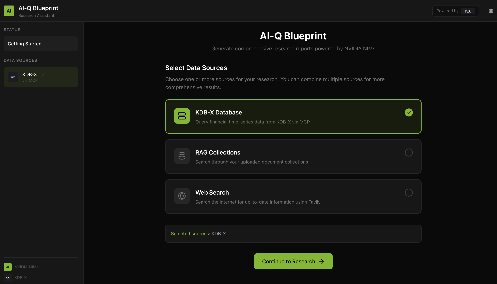
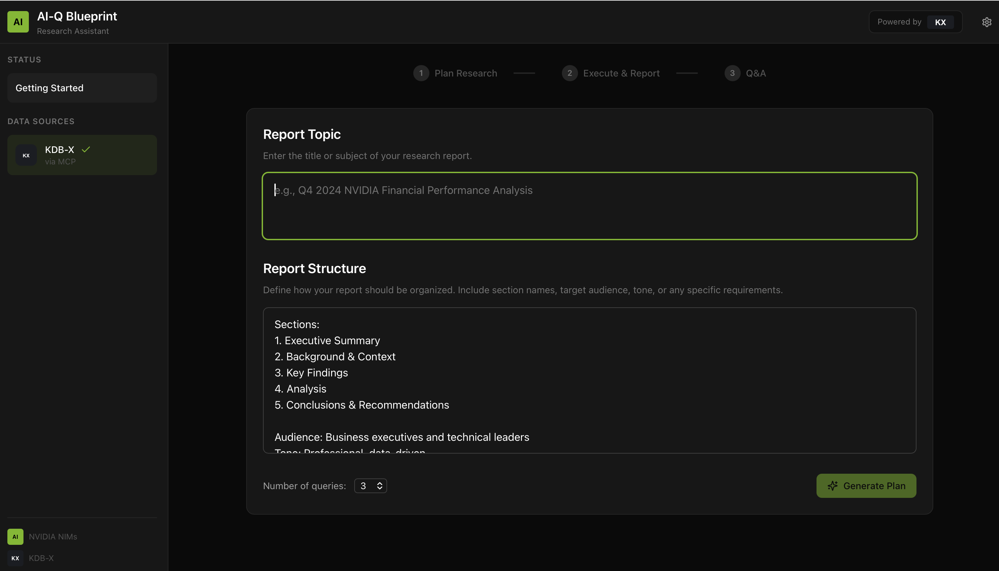
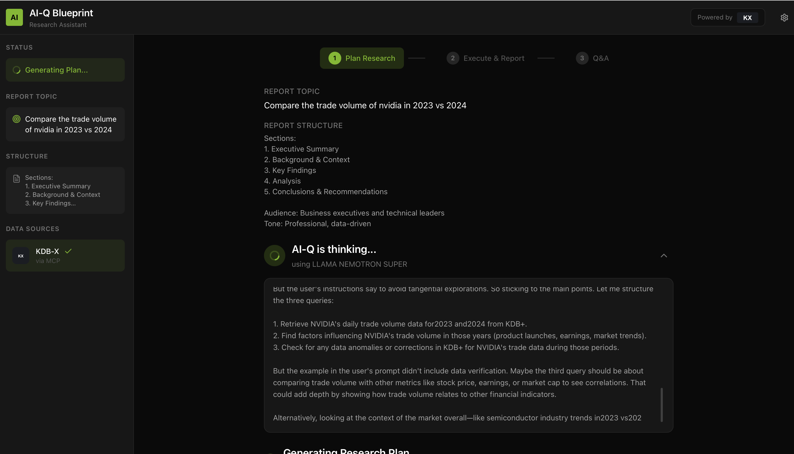
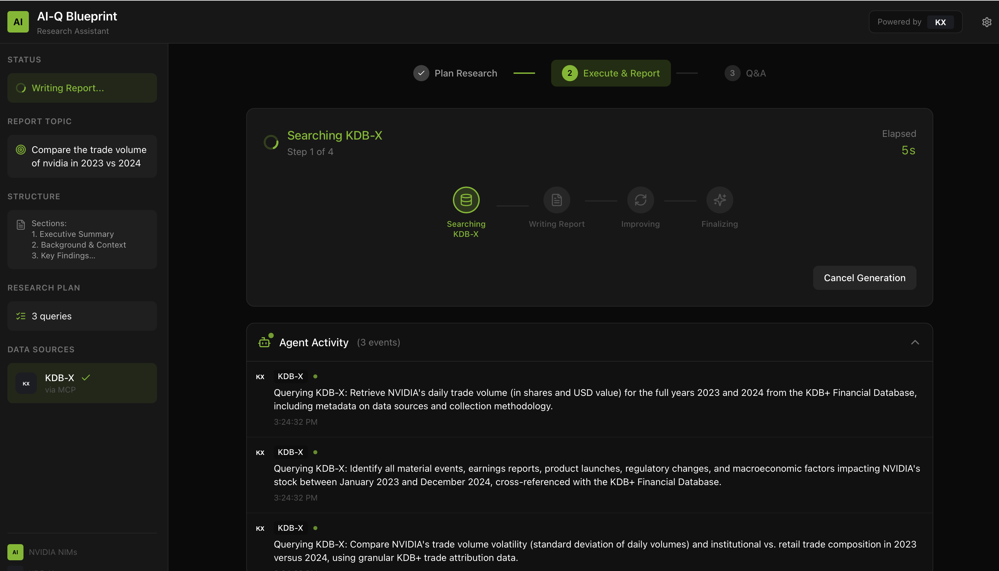
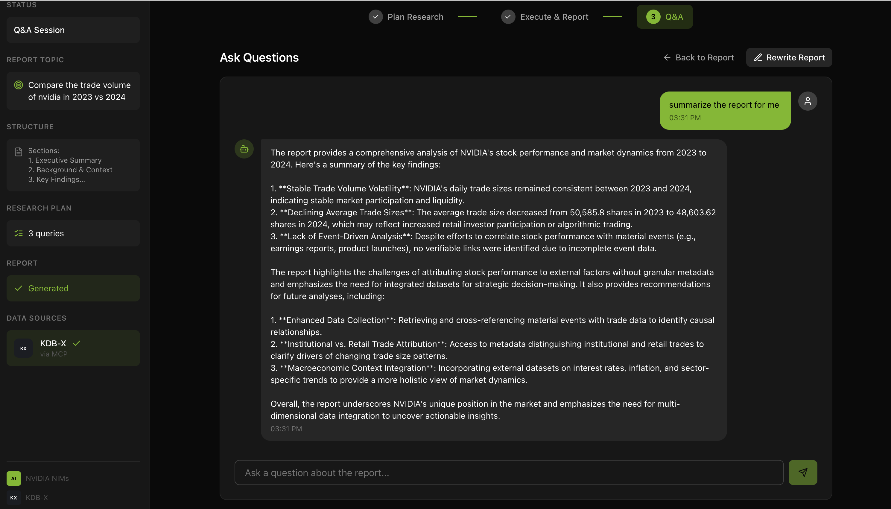
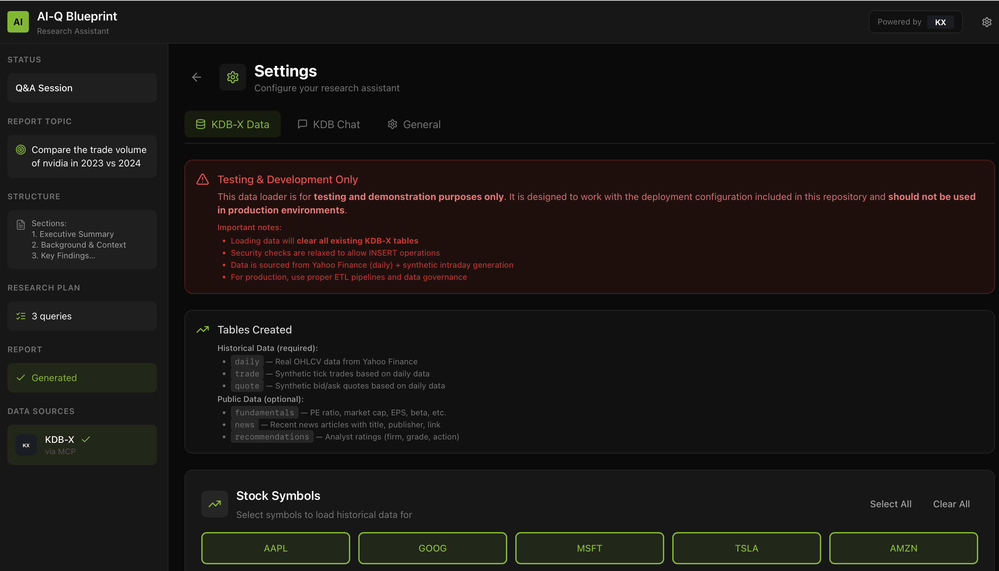
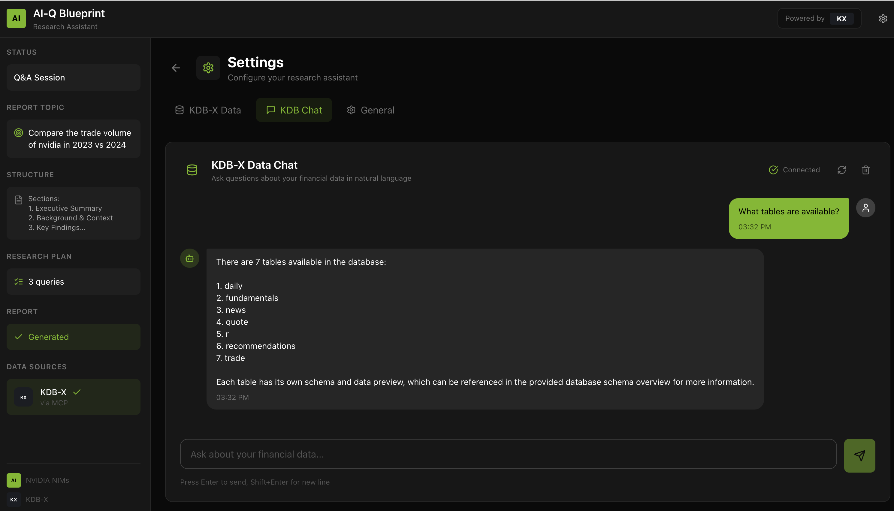

# Create Research Reports with AI-Q Blueprint User Interface

The AI-Q Research Assistant builds off of the NVIDIA RAG Blueprint, allowing users to upload multi-modal PDFs and then create detailed research reports. The **AIQ-KX** edition adds KDB-X financial data integration for time-series analysis.

## Getting Started

### Step 1: Select Data Sources

Choose one or more data sources for your research. You can combine multiple sources for comprehensive results:

- **KDB-X Database** - Query financial time-series data (stocks, trades, quotes)
- **RAG Collections** - Search through your uploaded document collections
- **Web Search** - Search the internet for up-to-date information using Tavily



### Step 2: Define Report Topic and Structure

Enter your research topic and customize the report structure. You can specify:

- **Report Topic** - The main subject of your research (e.g., "Compare the trade volume of NVIDIA in 2023 vs 2024")
- **Report Structure** - Define sections, target audience, and tone
- **Number of Queries** - How many research queries to generate



```
# Example Report Topic
Compare the trade volume of NVIDIA in 2023 vs 2024

# Example Report Structure
Sections:
1. Executive Summary
2. Background & Context
3. Key Findings
4. Analysis
5. Conclusions & Recommendations

Audience: Business executives and technical leaders
Tone: Professional, data-driven
```

### Step 3: Generate Research Plan

The AI-Q Blueprint uses the **Llama Nemotron Super** reasoning model to generate a research plan. You can watch the model's thinking process in real-time as it plans your queries.



### Step 4: Review and Execute Research Plan

Once reasoning is complete, review the generated research queries. Each query includes:

- **Query** - The specific question to research
- **Target Section** - Which report section this query supports
- **Rationale** - Why this query is important

You can add, edit, or remove queries before executing the plan.


```
# Example Research Plan

Query 1: Retrieve NVIDIA's daily trade volume (in shares and USD value) for the full years 2023 and 2024
Section: Background & Context
Rationale: Provides raw data for comparison

Query 2: Identify all material events, earnings reports, product launches, regulatory changes...
Section: Key Findings
Rationale: Context for volume fluctuations

Query 3: Compare NVIDIA's trade volume volatility (standard deviation of daily volumes)...
Section: Analysis
Rationale: Deeper statistical analysis
```

### Step 5: Monitor Report Generation

Click **Execute Plan** to start generating the report. The Agent Activity panel shows real-time progress:

- **Searching KDB-X** - Querying financial time-series data
- **Writing Report** - Generating report content
- **Improving** - Reflection and gap-filling
- **Finalizing** - Final formatting and citation



### Step 6: Q&A with Your Report

After the report is generated, use the Q&A interface to:

- Ask follow-up questions about the report
- Request summaries of specific sections
- Rewrite sections with different focus
- Export or share the final report



## KDB-X Data Management

### Loading Historical Data

Access the Settings panel to load historical stock data into KDB-X:

1. Click the **Settings** icon (gear) in the top navigation
2. Navigate to the **KDB-X Data** tab
3. Select stock symbols (AAPL, GOOG, MSFT, TSLA, AMZN, etc.)
4. Click to load historical data

> **Note:** The data loader is for testing and demonstration purposes only. Data is sourced from Yahoo Finance with synthetic intraday generation.



### KDB Chat - Natural Language Queries

The **KDB Chat** tab allows you to query your financial data using natural language:

- Ask about available tables and their schemas
- Query stock prices, trade volumes, and market data
- The system translates your questions to q/SQL automatically



```
# Example KDB Chat Queries

User: What tables are available?
System: There are 7 tables available in the database:
1. daily
2. fundamentals
3. news
4. quote
5. t
6. recommendations
7. trade

User: Show me NVIDIA's highest trading volume day in 2024
System: [Executes SQL query and returns results]
```

## Features Summary

| Feature | Description |
|---------|-------------|
| Multi-Source Research | Combine KDB-X, RAG, and Web Search |
| Reasoning Transparency | Watch AI thinking in real-time |
| Agent Activity | Track search operations with timing |
| Interactive Q&A | Ask questions about generated reports |
| Natural Language to SQL | Query KDB-X in plain English |
| Batch Data Loading | Load historical stock data with progress |

## Example Use Cases

1. **Financial Analysis**: "Compare AAPL and MSFT stock performance in Q4 2024"
2. **Market Research**: "Analyze trading volume patterns for tech stocks during earnings season"
3. **Multi-Source Reports**: "Research NVIDIA's AI strategy combining financial data and news articles"
4. **Historical Trends**: "Show year-over-year revenue growth for Amazon from SEC filings"
