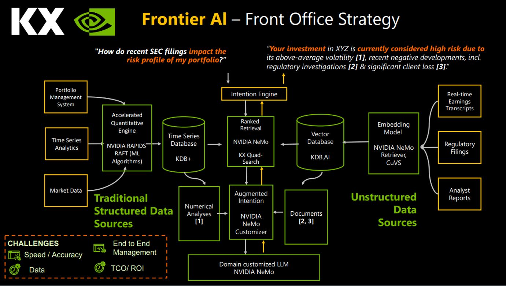

# NVIDIA & KX Samples

This repository contains samples that highlight the combination of KX and NVIDIA technologies. The focus is on combining insights from both structured and unstructured data through use-cases like advanced Retrieval-Augmented Generation (RAG).

## Samples

| Sample | Description |
|--------|-------------|
| [KX-nvidia-rag-blueprint](KX-nvidia-rag-blueprint) | **NVIDIA RAG Blueprint with KDB.AI** - Enterprise-ready RAG solution combining NVIDIA NIM microservices with KDB.AI vector database. Features multimodal document ingestion, GPU-accelerated search, React frontend, and multiple deployment options (Docker Compose, Kubernetes, EKS). |
| [KX-AIQ-nvidia-rag-blueprint](KX-AIQ-nvidia-rag-blueprint) | **AI-Q Research Assistant with KDB-X** - Deep research assistant that creates detailed reports using on-premise data and web search. Includes KDB-X financial data integration for real-time and historical time-series analysis. Pre-built Docker images available on KX Portal. |
| [NVIDIA_accelerated_RAG](NVIDIA_accelerated_RAG) | **Accelerated RAG Notebook** - Jupyter notebook demonstrating KDB.AI with NVIDIA NeMo Retriever, RAPIDS cuVS, and NIM LLMs. Shows ingestion and querying of vector embeddings with GPU acceleration. |

## Architecture Overview

## NVIDIA AI Software Stack

### NeMo Retriever

NeMo Retriever is part of the NVIDIA NeMo platform - a suite of AI models and tools for NLP and other AI tasks. It's a GPU-accelerated retrieval model enabling efficient and accurate information retrieval from large datasets. Key benefits include speed, accuracy, and scalability for applications like virtual assistants, search engines, and chatbots.

### NVIDIA RAPIDS, cuVS, RAFT

**NVIDIA RAPIDS** is an open-source framework that accelerates data science and ML workflows using GPUs. Built on CUDA, it provides libraries for data ingestion, processing, ML, and visualization with a Python API compatible with Pandas, NumPy, and scikit-learn.

**cuVS (CUDA Vector Search)** provides GPU-accelerated vector similarity search algorithms, enabling high-performance nearest neighbor search for RAG applications.

**RAFT (Reusable Accelerated Functions and Tools)** contains CUDA-accelerated algorithms and primitives for ML and information retrieval, forming building blocks for high-performance applications.

### NVIDIA NIM for LLMs

**NVIDIA NIM (NVIDIA Inference Microservices)** optimizes and manages AI inference workloads on NVIDIA GPUs. It provides tools and APIs for deploying, managing, and optimizing AI models with high performance, scalable deployment, and enterprise-grade security.

## Setup

Each sample has its own setup instructions in its respective directory:

- [KX-nvidia-rag-blueprint Setup](KX-nvidia-rag-blueprint/docs/change-vectordb-kdbai.md)
- [KX-AIQ-nvidia-rag-blueprint Setup](KX-AIQ-nvidia-rag-blueprint/README.md#aiq-kx-quick-start)
- [NVIDIA_accelerated_RAG Setup](NVIDIA_accelerated_RAG/README.md#setup)

## Dataset Disclaimer

In this repository, we may make available to you certain datasets for use with the Software. You are not obliged to use such datasets (with the Software or otherwise), but any such use is at your own risk. Any datasets that we may make available to you are provided "as is" and without any warranty, including as to their accuracy or completeness. We accept no liability for any use you may make of such datasets.

## License

See [LICENSE](LICENSE) for details.
