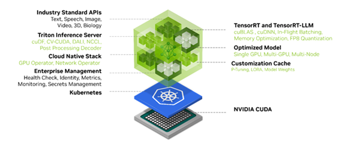

This repository contains samples that highlight the combination of KX and Nvidia technologies. The focus is on combining insights from both structured and unstructured data though use-cases like advanced Retrieval-Augmented Generation (RAG).

## How is it a differentiator in modern GenAI arena?

This architecture is an advanced depiction of processing domain specific data through modern high-end GPU’s (as compared to orthodox CPU setup), along-side customizing and fine-tuning the ML models and LLM’s according to individual/firm-based demand, thus providing unmatched performance and accuracy which is not possible through the generic models available in the market.

While plethora of implementations include processing of small sets of data and documents which might not be relevant to any particular industry and preforming a simple Q&A over the same, we have been able to demonstrate an Advanced RAG application capable of creating and ingesting vector embeddings from over 2 million documents into the KDB.AI vector DB.

Utilizing the latest LLM models like Llama-3.1 8B and 70B models as well as enriching them with the most advanced NVIDIA technology suite, our application has been able to provide most accurate and interactive answers to complex user queries all based on the ingested dataset which makes the results highly relevant and specific to the domain requirements.

All of the above are packed with performance as they maximize the use of the latest and most advanced NVIDIA GPU’s which are aided by NVIDIA software stack of NeMO Retriever, RAPIDS, Nemo Customizer and NIM LLM’s to deliver a seamless experience in terms of time for retrieval and generation of results which is beyond comparison and provides a massive boost to get customers far ahead of any competitors leveraging the above.

Clearly it provides a cutting edge and is the need of the hour in the growing AI industry and drastically proves to be a game-changer when considering a futuristic view migrating from the existing legacy CPU based architecture to the modern and advanced GPU based workflow utilizing our KDB.AI vector DB alongside NVIDIA technology stack.

## Sample Breakdown

At this time, the repository contains the following samples:

- [NVIDIA_accelerated_RAG](NVIDIA_accelerated_RAG): Temporal Similarity Search (Non Transformed) time series search.

## NVIDIA AI Software Stack

### NeMo Retriever

NeMo Retriever is a part of the Nvidia Nemo platform, which is a suite of AI models and tools designed to accelerate and simplify various tasks in natural language processing (NLP), computer vision, and other areas of AI research.
Specifically, Nemo Retriever is a GPU-accelerated retrieval model that enables efficient and accurate retrieval of relevant information from large datasets or knowledge bases. It's designed to help AI models and applications quickly find and retrieve relevant information, such as text passages, images, or other types of data, based on a given query or prompt.
Nemo Retriever uses a combination of neural networks and indexing techniques to achieve fast and accurate retrieval. It's particularly useful in applications such as question answering, text classification, and information retrieval, where rapid access to relevant information is critical. Some key benefits of Nemo Retriever include speed, accuracy and scalability with potential use cases such as Virtual Assistants, Search Engine, Chatbots and Knowledge Graph applications.

### NVIDIA RAPIDS, CUVS, RAFT

**NVIDIA Rapids** is an open-source software framework developed by Nvidia that enables data scientists and engineers to accelerate their data science and machine learning workflows using NVIDIA GPUs. Rapids is designed to provide a seamless and efficient way to process and analyze large datasets, leveraging the parallel processing capabilities of NVIDIA GPUs.
Rapids is built on top of the CUDA programming model and provides a set of libraries and tools that allow users to accelerate various stages of the data science workflow, including data ingestion, data processing, ML and data visualization. It provides a Python API, making it easy to integrate with popular data science libraries and frameworks, such as Pandas, NumPy, and scikit-learn.
Key benefits are accelerated performance, scalability and ease of use. It is widely applied to various industries including finance, healthcare, retail and scientific research.

**CUVS (CUDA Unified Virtualized Scheduler)** is a component of the Rapids ecosystem, which is an open-source software platform for accelerating data science and machine learning workloads on NVIDIA GPUs. CUVS is a scheduler that enables multiple processes to share the same GPU, improving GPU utilization and reducing the overhead of context switching between different processes. 
It provides a unified scheduling mechanism for CUDA, cuDNN, and other NVIDIA libraries, allowing multiple applications to share the GPU without the need for explicit synchronization or coordination which is achieved by virtualizing the CPUs, scheduling workloads and managing memory. It includes other tools and libraries like cuDF, cuML, and cuGraph, all designed to accelerate the GPUs.

**RAFT (Reusable Accelerated Functions and Tools)** contains fundamental widely-used algorithms and primitives for machine learning and information retrieval. The algorithms are CUDA-accelerated and form building blocks for more easily writing high performance applications. It accelerates the algorithm construction time, reduces the maintenance burden by maximizing reuse across projects, and centralizes core reusable computations, allowing future optimizations to benefit all algorithms that use them.
Raft is used as the consensus algorithm for distributed training and inference in machine learning and deep learning applications. This allows to scale to large clusters of GPUs and ensure that the system remains available and fault-tolerant even in the presence of node failures.

### NeMo Customizer
NeMo Customizer is an end-to-end platform for developing custom generative AI includes tools for training, fine-tuning, retrieval-augmented generation (RAG), guardrailing, and data curation, along with pretrained models. It has offerings across the tech stack, from frameworks to higher-level API endpoints.
Built on top of the NeMo framework it provides the easiest path for enterprises to get started with fine-tuning LLMs, thereby facilitating a fast, cost-effective way to adopt generative AI. NeMo Customizer simplifies LLM customization by leveraging the quickly deployable microservices, accelerates training performance using parallelism techniques, and scales to multi-GPU and multinodes. Benefits include faster time to market, accelerated performance and scalability.

### NVIDIA NIM for LLMs
**NVIDIA NIM (NVIDIA Inference Manager)** is a software development kit (SDK) designed to optimize and manage AI inference workloads on NVIDIA GPUs. It provides a set of tools and APIs that enable developers to deploy, manage, and optimize AI models on NVIDIA hardware, ensuring efficient and scalable inference performance.
NIM is part of the NVIDIA TensorRT (Tensor Runtime) platform, which is a software development kit for high-performance AI inference NIM provides several key features to optimize AI inference workloads, including model optimization, model management, interference engine, resource management and scalability.
NVIDIA NIM for large language models (LLMs) brings the power of state-of-the-art LLMs to enterprise applications, providing unmatched natural language processing and understanding capabilities. It provides high performance features like scalable deployment, advanced language model, flexible integration and enterprise grade security.

## Setup

Each sample will have included setup instructions.

## Dataset Disclaimer

In this repository, we may make available to you certain datasets for use with the Software.
You are not obliged to use such datasets (with the Software or otherwise), but any such use is at your own risk.
Any datasets that we may make available to you are provided “as is” and without any warranty, including as to their accuracy or completeness.
We accept no liability for any use you may make of such datasets.
