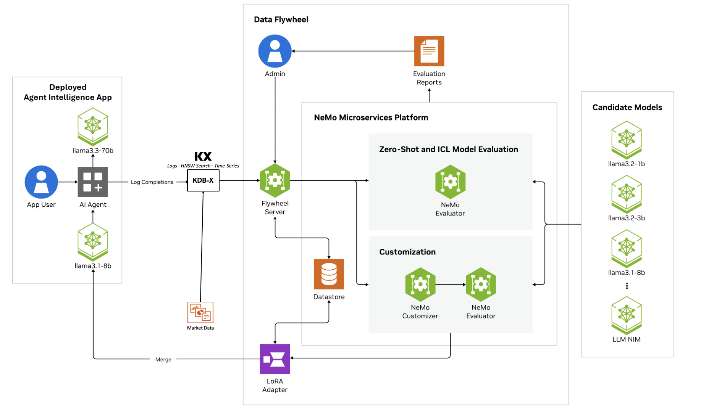
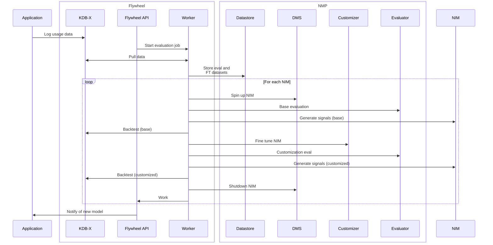
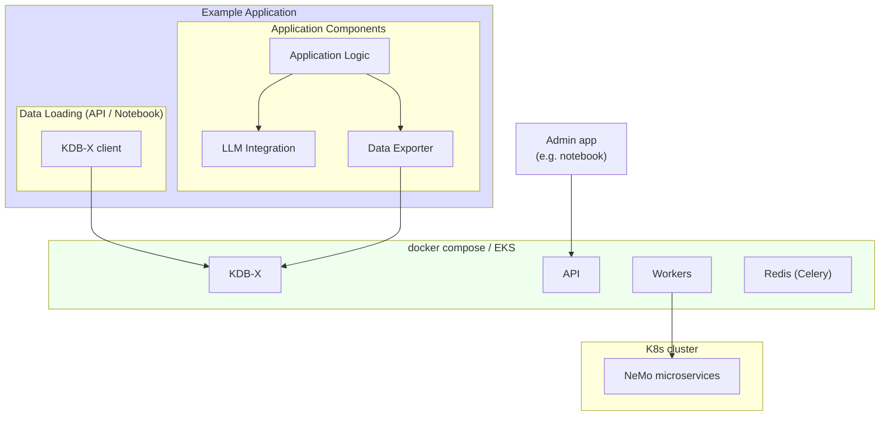

# AI Model Distillation for Financial Data Developer Example Overview

## Core Components Required for a flywheel

1. **Instrumented Gen-AI Application**: Your service must tag distinct workloads (routes, nodes, agent steps) and log every prompt/completion pair.
2. **Log Store**: KDB-X captures production traffic so datasets can be built automatically, with native vector search and financial time-series support.
3. **Dataset & Model Ops Infra**: The developer example spins up NeMo Datastore, Evaluator, Customizer, plus local API & workers to orchestrate jobs.
4. **Post-Eval Human Review**: Engineers/researchers validate promising models before promotion; no user feedback collection.

Think of this flywheel as a discovery and promotion service that surfaces promising smaller models rather than a fully autonomous replacement engine.

## AI Model Distillation for Financial Data Architecture Diagram

The following diagram illustrates the high-level architecture of the developer example:

> **Note**
>
> Version 1 of the developer example optimizes **cost & latency** via model distillation.
>
> Version 2 adds KDB-X as the unified data platform, enabling financial-grade backtesting and market-data enrichment alongside model distillation.

### How Production Logs Flow Into the Flywheel

> **📖 For complete data logging implementation:** See [Data Logging Guide](data-logging.md)

Use a continuous log exportation flow for your production environments:

1. **Application emits JSON**: Every prompt/response is captured by your service (language-agnostic; any HTTP middleware, logger, or side-car works).
2. **Exporter ships records**: A lightweight log exporter forwards those records to KDB-X in near real-time.
3. **Flywheel API pulls data**: Workers query KDB-X to build *evaluation* and *fine-tune* splits automatically.

## Deployment Architecture

## Automatic Resource Cleanup

The AI Model Distillation for Financial Data developer example includes an **automatic cleanup system** that ensures proper resource management when the system is shut down unexpectedly or when workers are terminated. This prevents resource leaks and ensures clean system state.

### How Automatic Cleanup Works

The `CleanupManager` automatically activates during worker shutdown and performs the following operations:

1. **Detects running resources**: Finds all jobs with `PENDING` or `RUNNING` status
2. **Identifies active NIMs**: Locates all NVIDIA Inference Microservices with `RUNNING` deployment status
3. **Cancels running jobs**: Cancels active customization jobs through NeMo Customizer
4. **Shuts down deployments**: Stops all running NIM deployments via NeMo Deployment Manager
5. **Shuts down LLM judge**: Stops the LLM judge deployment if running
6. **Deletes customization configs**: Removes customization target configs for all NIMs in settings
7. **Updates database state**: Marks all resources as `CANCELLED` with appropriate timestamps and error messages

### When Automatic Cleanup Triggers

The cleanup manager activates automatically in these scenarios:

- **Worker shutdown**: When Celery workers receive shutdown signals (SIGTERM, SIGINT)
- **Container termination**: When Docker containers are stopped, triggering Celery worker shutdown
- **System restart**: During planned or unplanned system restarts

### Safety Features

- **Database-driven**: Only cleans up resources marked as running in the database
- **Error resilience**: Continues cleanup even if individual operations fail
- **Comprehensive logging**: Records all cleanup actions and errors for debugging
