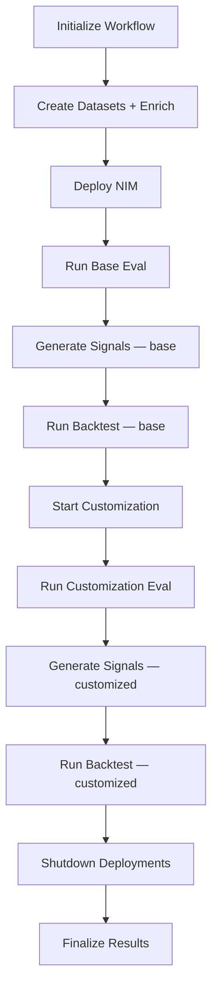
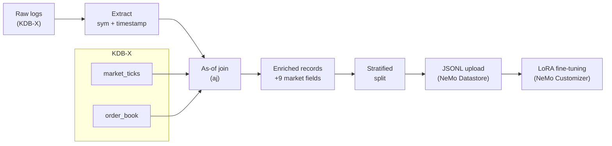
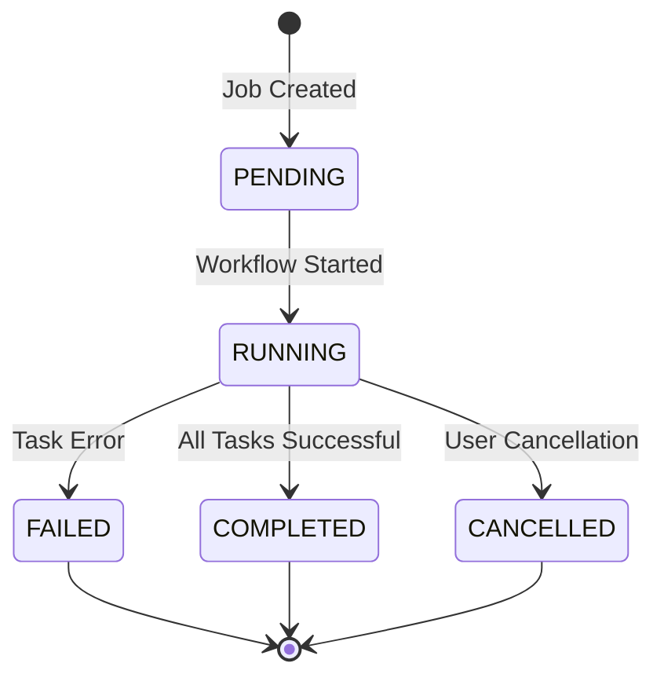

# Task Orchestration and Workflow Management

Learn how the developer example orchestrates complex workflows using Celery for task management, job lifecycle control, and resource cleanup.

## Workflow Architecture

The developer example uses a **Directed Acyclic Graph (DAG)** of Celery tasks to orchestrate the complete flywheel workflow. Each job progresses through multiple stages with automatic error handling and resource cleanup.

### High-Level Workflow Stages



The pipeline runs **fully sequentially** per NIM. Each model (base and customized) goes through evaluation, signal generation, and backtesting in order — ensuring that backtest always has signals to work with.

## Task Definitions and Dependencies

### 1. **`initialize_workflow`**
**Purpose**: Sets up the job run, validates configuration, and prepares the job for execution.

**Source**: `src/tasks/tasks.py`

**Key Operations**:
- Validates workload_id and client_id
- Initializes database records
- Sets job status to `RUNNING`

**Dependencies**: None (entry point)

```python
# Example task invocation
run_nim_workflow_dag.delay(
    workload_id="customer-service-v1",
    flywheel_run_id="507f1f77bcf86cd799439011",
    client_id="production-app"
)
```

### 2. **`create_datasets`** (with enrichment and labeling)
**Purpose**: Extracts data from KDB-X, creates training/evaluation datasets, enriches training records with market-data features, and labels records with empty responses using market returns.

**Source**: `src/tasks/tasks.py`

**Key Operations**:
- Queries KDB-X for logged interactions
- Validates data format (OpenAI chat completion format)
- Creates evaluation and fine-tuning datasets
- Applies data split configuration
- Uploads datasets to NeMo Data Service
- Runs market-data enrichment on training records (see below)
- Runs market-return labeling on records with empty responses (see below)
- Persists enrichment statistics (`records_enriched`, `features_added`, `enrichment_time_seconds`) to `flywheel_runs.enrichment_stats`

**Dependencies**: `initialize_workflow`

**Dataset Types Created**:
- **Base Evaluation**: Held-out production data for baseline testing
- **Fine-tuning**: Training data for model customization

#### How Market Data Enriches Student Model Training

This is one of the key differentiators of the financial data developer example. Before training records are sent to NeMo Customizer, the pipeline enriches each record with **point-in-time market context** from KDB-X, so the student model learns to correlate market conditions with financial decisions.



**Step 1 — Ticker extraction.** For each record, `kdbx/enrichment.py:extract_sym_from_record()` determines the ticker symbol. Extraction mode is configurable: read from a record field (`sym_extraction: "field"`) or parse from the user query via regex (`sym_extraction: "regex"`). Falls back to `default_sym` (default `"SPY"`) when extraction fails.

**Step 2 — KDB-X as-of join.** The enrichment function issues a single batch as-of join (`aj`) against `market_ticks` and `order_book`. For each record's `(sym, timestamp)`, KDB-X finds the most recent market snapshot **at or before** that timestamp — no look-ahead bias.

**Step 3 — Market fields added.** Each record gains 9 financial context fields:

| Field | Source Table | Description |
|---|---|---|
| `market_close` | `market_ticks` | Last traded price at event time |
| `market_vwap` | `market_ticks` | Volume-weighted average price |
| `market_high` | `market_ticks` | Intraday high |
| `market_low` | `market_ticks` | Intraday low |
| `market_volume` | `market_ticks` | Trading volume |
| `market_bid` | `order_book` | Best bid price |
| `market_ask` | `order_book` | Best ask price |
| `market_spread` | `order_book` | Bid-ask spread |
| `market_mid` | `order_book` | Mid-price |

**Step 4 — Training.** The enriched records are split (eval / train / val), converted to chat-format JSONL, uploaded to NeMo Datastore, and used by NeMo Customizer for LoRA fine-tuning. The student model trains on conversations that include synchronized market state, teaching it to associate market conditions with financial classifications.

<details>
<summary><strong>Example: enriched training record</strong></summary>

```json
{
  "request": {
    "messages": [
      {"role": "user", "content": "Classify: AAPL beats Q3 earnings estimates by 12%"}
    ]
  },
  "response": {
    "choices": [
      {"message": {"content": "Earnings Beat"}}
    ]
  },
  "sym": "AAPL",
  "timestamp": "2025-01-15T10:00:00",
  "market_close": 150.50,
  "market_vwap": 150.25,
  "market_high": 151.00,
  "market_low": 149.75,
  "market_volume": 45000000,
  "market_bid": 150.45,
  "market_ask": 150.55,
  "market_spread": 0.10,
  "market_mid": 150.50
}
```

</details>

**Graceful degradation.** Enrichment is non-fatal — if `market_ticks` is empty or KDB-X is unreachable, training proceeds with unenriched records and the job still completes. Enrichment statistics in the job response (`enrichment_stats`) let you confirm whether enrichment ran.

**Configuration.** See [Enrichment Configuration](03-configuration.md#enrichment-configuration) for all options (`enabled`, `sym_field`, `sym_extraction`, `default_sym`).

#### Market-Return Labeling for Training Data

After enrichment, records with **empty** `response.choices[0].message.content` are labeled using next-day market returns from `market_ticks`. This is critical for fine-tuning: without labeled responses, the customized model learns to output nothing and produces 100% HOLD signals.

**How it works:**
1. For each record with an empty response, the pipeline extracts the ticker (`sym`) and event timestamp
2. A KDB-X as-of join (`aj`) against `market_ticks` finds the close price at event time (entry) and 1 day later (exit)
3. The next-day return determines the label: return > +threshold → BUY, < -threshold → SELL, else HOLD (threshold is configurable via `signal_config.labeling.return_threshold_bps`, default 50 bps = 0.5%)
4. The response content is populated with a template rationale: `"BUY — AAPL next-day return +1.50% ($185.50 → $188.28)"`

Records with existing (non-empty) response content are never overwritten.

**Configuration.** See [Signal Generation Configuration](03-configuration.md#signal-generation-configuration) for all labeling options.

#### ICL Example Selection Methods

The developer example supports two methods for selecting in-context learning examples:

**1. Uniform Distribution** (`uniform_distribution`)
- **Description**: Distributes examples evenly across different tool types
- **Use Case**: Provides balanced representation of all available tools
- **Behavior**: For tool-calling workloads, ensures each tool gets roughly equal representation in the ICL examples
- **Requirements**: No additional configuration needed
- **Performance**: Fast selection with no additional infrastructure requirements

**2. Semantic Similarity** (`semantic_similarity`)
- **Description**: Selects examples based on semantic similarity using vector embeddings
- **Use Case**: Finds the most relevant examples for each evaluation query
- **Behavior**:
  - Uses an embedding model to identify semantically similar examples from historical data
  - For tool-calling workloads, applies a relevance-coverage strategy
  - The `relevance_ratio` parameter controls the trade-off:
    - Default 0.7 = 70% examples selected for pure semantic relevance
    - Remaining 30% selected to ensure coverage of different tools
    - Value of 1.0 disables coverage-based selection entirely
- **Requirements**: Requires `similarity_config` with `embedding_nim_config`

### 3. **`spin_up_nim`**
**Purpose**: Deploys a NIM model and waits for readiness

**Source**: `src/tasks/tasks.py`

**Key Operations**:
- Deploys NIM with specified configuration
- Waits for model readiness

**Dependencies**: `create_datasets`

**Sequential Pattern**: NIMs are deployed one at a time to manage resource allocation and avoid GPU conflicts.

### 4. **`run_base_eval`**
**Purpose**: Runs evaluations against deployed NIMs using F1-score metrics.

**Source**: `src/tasks/tasks.py`

**Key Operations**:
- Executes base evaluations on held-out test data
- Calculates F1-scores
- Stores results in database and MLflow (if enabled)

**Dependencies**: `spin_up_nim`


### 5. **`generate_signals`**
**Purpose**: Calls the deployed NIM to generate trading signals from evaluation records, then writes them to the KDB-X `signals` table.

**Source**: `src/tasks/tasks.py`

**Key Operations**:
- Fetches evaluation records from KDB-X via `RecordExporter`
- Prepends a configurable system prompt to each NIM request (from `signal_config.system_prompt`), unless the record already has a system message
- Calls the NIM `/v1/chat/completions` endpoint for each record
- Parses model responses to extract a trading direction (BUY/SELL/HOLD)
- Extracts ticker symbols from records using `kdbx.enrichment.extract_sym_from_record`
- Uses the original event timestamp from the record (not wall-clock time) for accurate backtesting
- Writes signals in batch to the `signals` table via `kdbx.signals.write_signals_batch`

**Dependencies**: `run_base_eval` (for base model) or `run_customization_eval` (for customized model)

**Parameters**:
- `model_type="base"` — uses the base NIM model name
- `model_type="customized"` — uses the customized model name from `previous_result.customization.model_name`

### 6. **`start_customization`**
**Purpose**: Initiates fine-tuning of candidate models using production data.

**Source**: `src/tasks/tasks.py`

**Key Operations**:
- Creates customization jobs in NeMo Customizer
- Configures LoRA training parameters
- Monitors training progress
- Handles training failures and retries

**Dependencies**: `run_backtest_assessment` (base) — runs after the base model's backtest completes

**Customization Features**:
- **LoRA Fine-tuning**: Parameter-efficient training
- **Multi-GPU Support**: Distributed training across multiple GPUs
- **Progress Monitoring**: Real-time training progress tracking

### 7. **`run_customization_eval`**
**Purpose**: Evaluates fine-tuned models against base evaluation datasets using F1-score metrics.

**Source**: `src/tasks/tasks.py`

**Key Operations**:
- Deploys customized models
- Runs same evaluation as base models
- Calculates F1-scores to compare with base evaluation

**Dependencies**: `start_customization`

### 8. **`run_backtest_assessment`**
**Purpose**: Evaluates the model's trading signals using a vectorised KDB-X backtest.

**Source**: `src/tasks/tasks.py`

**Key Operations**:
- Checks if signals exist for the model in the `signals` table
- Skips if signal count is below `backtest_config.min_signals` (default 10)
- Calls `kdbx/backtest.py:run_backtest()` — vectorised `aj` join for entry/exit prices
- Stores backtest evaluation results (Sharpe, drawdown, win rate, etc.) in the `evaluations` table with `eval_type="backtest-eval"`
- Configurable: `cost_bps` (transaction cost), `min_signals` threshold

**Dependencies**: `generate_signals` — runs immediately after signal generation for each model

**Parameters**:
- `model_type="base"` — backtests signals from the base model
- `model_type="customized"` — backtests signals from the customized model

The backtest runs **twice** per flywheel run: once for the base model and once for the customized model, allowing direct comparison of trading performance before and after fine-tuning.

### 9. **`shutdown_deployment`**
**Purpose**: Gracefully shuts down NIM deployments to free resources.

**Source**: `src/tasks/tasks.py`

**Key Operations**:
- Marks the NIM as completed by updating deployment status in database
- Stops the NIM deployments
- Preserves evaluation results and model artifacts

**Dependencies**: `run_backtest_assessment` (customized) — the last task in the sequential chain

### 10. **`finalize_flywheel_run`**
**Purpose**: Aggregates results and marks the job as complete.

**Source**: `src/tasks/tasks.py`

**Key Operations**:
- Updates job status to `COMPLETED`

**Dependencies**: `shutdown_deployment`

## Job Lifecycle Management

### Job States and Transitions

**Source**: `src/api/schemas.py` (FlywheelRunStatus enum)



**Note**: Both flywheel runs (FlywheelRunStatus) and individual NIM runs (NIMRunStatus) support CANCELLED states.

### Cancellation Mechanism

**Source**: `src/lib/flywheel/cancellation.py:1-46`

The flywheel implements **graceful cancellation** with automatic resource cleanup:

```python
def check_cancellation(flywheel_run_id: str) -> None:
    """Check if the flywheel run has been cancelled and raise exception if so."""
    # Checks database for cancellation status
    # Raises FlywheelCancelledError to stop task execution
```

**Cancellation Process**:
1. User calls `POST /api/jobs/{id}/cancel`
2. Database marks job as `CANCELLED`
3. All running tasks check cancellation status
4. Tasks raise `FlywheelCancelledError` and exit
5. Cleanup manager removes all resources
6. Job remains in `CANCELLED` state

### Automatic Resource Cleanup

**Source**: `src/lib/flywheel/cleanup_manager.py:1-232`

The cleanup manager automatically handles resource management during:
- Normal workflow completion
- Job cancellation
- System shutdown
- Worker crashes

**Cleanup Operations**:
```python
class CleanupManager:
    def cleanup_all_running_resources(self):
        """Main cleanup procedure for all running resources."""
        # 1. Find all running flywheel runs
        # 2. Clean up each flywheel run
        # 3. Clean up customization configs
        # 4. Report cleanup results
```

## Monitoring and Observability

### Celery Task Monitoring

**Flower Web UI**: Available at `http://localhost:5555` during development

**Key Metrics to Monitor**:
- **Active Tasks**: Currently executing tasks
- **Task Queue Length**: Pending tasks waiting for workers
- **Task Success/Failure Rate**: Overall workflow reliability
- **Resource Utilization**: Worker CPU and memory usage

### Database Monitoring

**Job Progress Tracking**:
```python
# Query job status
db.flywheel_runs.find_one({"_id": ObjectId(job_id)})

# Monitor NIM deployments and evaluations
db.nims.find({"flywheel_run_id": job_id})

# Check evaluation results
db.evaluations.find({"nim_id": nim_id})
```

**Key KDB-X Tables**:
- `flywheel_runs`: Overall job status and metadata
- `nims`: NIM deployment and evaluation status
- `evaluations`: Individual evaluation results and metrics
- `customizations`: Model customization job tracking

**Note**: The code examples above use pymongo-style syntax (e.g., `db.flywheel_runs.find_one(...)`) which still works via the KDBXCollection pymongo-compatibility shim in `kdbx/compat.py`.

### Logging Configuration

**Source**: `src/log_utils.py`

Structured logging with configurable levels:
```python
logger = setup_logging("data_flywheel.tasks")
logger.info(f"Starting workflow for job {flywheel_run_id}")
logger.error(f"Task failed: {error_message}")
```

## Troubleshooting Common Issues

### Task Failure Scenarios

#### 1. **Data Validation Failures**
**Symptoms**: Job fails during `create_datasets` stage
**Causes**:
- Insufficient data in KDB-X
- Invalid OpenAI format in logged data
- Missing required fields (workload_id, client_id)

**Solution**:
```python
# Check data quality via KDB-X
import pykx as kx
with kx.SyncQConnection(host="localhost", port=8082) as conn:
    print(conn("select count i from flywheel_data"))

# Validate data format by loading via the API
curl -X POST http://localhost:8000/api/jobs \
  -H "Content-Type: application/json" \
  -d '{"workload_id": "test-validation", "client_id": "my-client"}'
```

#### 2. **NIM Deployment Failures**
**Symptoms**: Job fails during `spin_up_nim` stage
**Causes**:
- Insufficient GPU resources
- Network connectivity issues
- Invalid model configurations

**Solution**:
```bash
# Check GPU availability
nvidia-smi

# Verify NeMo connectivity
curl "http://nemo.test/v1/models"

# Check Kubernetes resources
kubectl get pods -n dfwbp
```

#### 3. **Evaluation Timeouts**
**Symptoms**: Tasks hang during evaluation stages
**Causes**:
- Large dataset size
- Slow model inference
- Network latency to remote services

**Solution**:
```yaml
# Increase task timeout in config
celery_config:
  task_time_limit: 7200  # 2 hours
  task_soft_time_limit: 6600  # 1.8 hours
```

### Recovery Procedures

#### Manual Task Recovery
```python
# Cancel stuck job
POST /api/jobs/{job_id}/cancel

# Clean up resources manually
from src.lib.flywheel.cleanup_manager import CleanupManager
cleanup = CleanupManager(db_manager)
cleanup.cleanup_all_running_resources()
```

#### Database Consistency Check
```python
# Find orphaned resources via KDB-X
import pykx as kx
with kx.SyncQConnection(host="localhost", port=8082) as conn:
    orphaned = conn("select from nims where status=`running, not flywheel_run_id in exec _id from flywheel_runs where status=`running")

# Reset stuck jobs
with kx.SyncQConnection(host="localhost", port=8082) as conn:
    conn("update status:`failed, error:`$\"Timeout recovery\" from `flywheel_runs where status=`running, started_at<cutoff_time")
```

