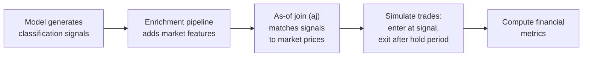
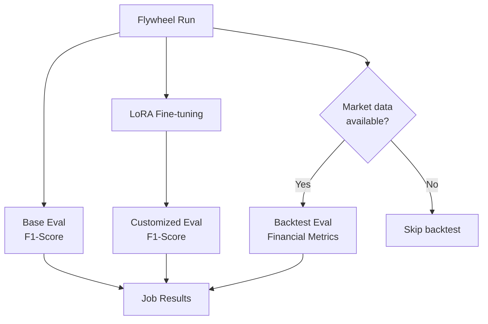

# Financial Backtesting: Why NLP Accuracy Isn't Enough

## The Problem

F1-score tells you how well a distilled model reproduces the teacher's text outputs. It does **not** tell you whether those outputs make money.

Consider two models fine-tuned on the same financial news classification task:

| Model | F1-Score | Sharpe Ratio | Win Rate | Max Drawdown |
|-------|----------|-------------|----------|--------------|
| Model A | 0.95 | 1.8 | 62% | -8% |
| Model B | 0.95 | 0.3 | 48% | -22% |

Both achieve identical NLP accuracy, but Model A produces trading signals that generate strong risk-adjusted returns while Model B barely breaks even with severe drawdowns. The difference? Model B misclassifies the *high-impact* events — the ones that move markets — even though its overall token-level accuracy is the same.

For financial applications, **business value is the real metric**. Backtest evaluation bridges this gap.

## The Solution: Backtest Evaluation

The system includes a backtest evaluation pipeline that runs model signals through a simulated trading strategy using real market data. Instead of only asking "did the model produce the right text?", it asks "did the model's predictions make money?"

This runs automatically as part of the flywheel DAG when market data is available — no extra configuration needed.

## How It Works

### Step by Step

1. **Signal generation**: During a flywheel run, the student model classifies financial news headlines into event categories (e.g., "earnings_beat", "regulatory_action", "market_crash").

2. **Market data enrichment**: The enrichment pipeline joins each signal with market tick data — price, volume, and derived features like moving averages and volatility.

3. **As-of join (`aj`)**: KDB-X's temporal join matches each signal to the most recent market price at the time the signal was generated. This prevents look-ahead bias — the backtest only uses data that would have been available in real time.

4. **Trade simulation**: For each signal, the system enters a position at the matched price and exits after a configurable hold period (default: 1 day). Transaction costs are applied (default: 5 basis points per trade).

5. **Metric computation**: The system computes financial performance metrics across all trades.

## Financial Metrics Explained

| Metric | What It Measures | What "Good" Looks Like |
|--------|-----------------|----------------------|
| **Sharpe Ratio** | Risk-adjusted return — mean return divided by return volatility | > 1.0 is good; > 2.0 is strong |
| **Max Drawdown** | Largest peak-to-trough decline during the backtest | Closer to 0% is better; beyond -20% is concerning |
| **Total Return** | Cumulative net return after transaction costs | Positive and consistent across time periods |
| **Win Rate** | Fraction of trades that were profitable | > 50% for a long-only strategy; context-dependent |
| **N Trades** | Number of signals with valid entry/exit prices | Enough trades for statistical significance (50+) |

### Reading the Results Together

No single metric tells the full story:

- **High Sharpe + low drawdown** = consistent, reliable strategy. This is the ideal outcome.
- **High return + high drawdown** = the model catches big moves but has painful losing streaks. May need position sizing adjustments.
- **High win rate + low Sharpe** = many small wins offset by a few large losses. The model may misclassify tail-risk events.
- **Low N trades** = not enough data to draw conclusions. Run with more data before making deployment decisions.

## Integration into the Flywheel

Backtest evaluation is the third evaluation type in the flywheel DAG, alongside base and customized F1-score evaluations:

- **Automatic**: Backtest evaluation triggers automatically when the enrichment pipeline has produced market data. No manual setup required.
- **Alongside F1**: Results appear in the job details alongside base and customized F1-scores, giving you both NLP accuracy and financial validation in one view.
- **Configurable**: Hold period and transaction costs can be adjusted via configuration. See the [Configuration Guide](03-configuration.md) for details.

## Why This Matters

Model distillation for financial applications has a unique requirement: the distilled model must not only reproduce the teacher's outputs accurately, but those outputs must remain **actionable in markets**. A model that achieves 0.95 F1-score but systematically misclassifies market-moving events is worse than useless — it's dangerous.

Backtest evaluation catches these failure modes before deployment, giving you confidence that your distilled model preserves both the teacher's linguistic accuracy **and** its financial signal quality.

---

**Related documentation:**
- [Evaluation Types and Metrics](06-evaluation-types-and-metrics.md) — full reference for all three evaluation types
- [Architecture Overview](01-architecture.md) — how backtesting fits into the overall system
- [Configuration Guide](03-configuration.md) — configuring backtest parameters
