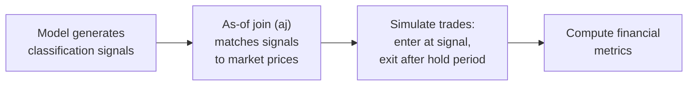
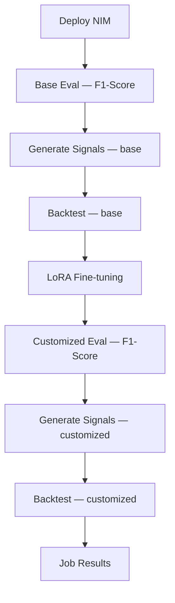

<!--
SPDX-FileCopyrightText: Copyright (c) 2026 KX Systems, Inc. All rights reserved.
SPDX-License-Identifier: Apache-2.0

Licensed under the Apache License, Version 2.0 (the "License");
you may not use this file except in compliance with the License.
You may obtain a copy of the License at

http://www.apache.org/licenses/LICENSE-2.0

Unless required by applicable law or agreed to in writing, software
distributed under the License is distributed on an "AS IS" BASIS,
WITHOUT WARRANTIES OR CONDITIONS OF ANY KIND, either express or implied.
See the License for the specific language governing permissions and
limitations under the License.
-->

# Financial Backtesting: Why NLP Accuracy Isn't Enough

## The Problem

F1-score tells you how well a distilled model reproduces the teacher's text outputs. It does **not** tell you whether those outputs make money.

Consider two models fine-tuned on the same financial news classification task:

| Model | F1-Score | Sharpe Ratio | Win Rate | Max Drawdown |
|-------|----------|-------------|----------|--------------|
| Model A | 0.95 | 1.8 | 62% | -8% |
| Model B | 0.95 | 0.3 | 48% | -22% |

Both achieve identical NLP accuracy, but Model A produces trading signals that generate strong risk-adjusted returns while Model B barely breaks even with severe drawdowns. The difference? Model B misclassifies the *high-impact* events — the ones that move markets — even though its overall token-level accuracy is the same.

For financial applications, **business value is the real metric**. Backtest evaluation bridges this gap.

## The Solution: Backtest Evaluation

The system includes a backtest evaluation pipeline that runs model signals through a simulated trading strategy using real market data. Instead of only asking "did the model produce the right text?", it asks "did the model's predictions make money?"

This runs automatically as part of the flywheel DAG when market data is available — no extra configuration needed.

## How It Works

### Step by Step

1. **Signal generation**: After each evaluation (base and customized), the `generate_signals` task calls the deployed NIM with the evaluation records and parses each response to extract a trading direction (BUY/SELL/HOLD). These signals are written to the KDB-X `signals` table with a timestamp, ticker symbol, model ID, and the model's rationale.

2. **As-of join (`aj`)**: KDB-X's temporal join matches each signal to the most recent `close` price from `market_ticks` at the time the signal was generated, and again 1 day later for the exit price. This prevents look-ahead bias — the backtest only uses data that would have been available in real time. Signals use the original event timestamp from the training record (not the time the signal was generated), ensuring accurate temporal alignment with market data.

   > **Important**: The `market_ticks` table must be sorted by `sym` then `timestamp` for `aj` to return correct results. The data loaders (`market_tables.py`, `load_alpaca_data.py`) apply `` `sym`timestamp xasc `market_ticks `` after each data load to ensure correct sort order.

3. **Trade simulation**: For each signal, the system enters a position at the entry price and exits at the close price 1 day later. Transaction costs are applied (default: 5 basis points round-trip).

4. **Metric computation**: The system computes financial performance metrics across all trades.

## Financial Metrics Explained

| Metric | What It Measures | What "Good" Looks Like |
|--------|-----------------|----------------------|
| **Sharpe Ratio** | Risk-adjusted return — mean return divided by return volatility | > 1.0 is good; > 2.0 is strong |
| **Max Drawdown** | Largest peak-to-trough decline during the backtest | Closer to 0% is better; beyond -20% is concerning |
| **Total Return** | Cumulative net return after transaction costs | Positive and consistent across time periods |
| **Win Rate** | Fraction of trades that were profitable | > 50% for a long-only strategy; context-dependent |
| **N Trades** | Number of signals with valid entry/exit prices | Enough trades for statistical significance (50+) |

### Reading the Results Together

No single metric tells the full story:

- **High Sharpe + low drawdown** = consistent, reliable strategy. This is the ideal outcome.
- **High return + high drawdown** = the model catches big moves but has painful losing streaks. May need position sizing adjustments.
- **High win rate + low Sharpe** = many small wins offset by a few large losses. The model may misclassify tail-risk events.
- **Low N trades** = not enough data to draw conclusions. Run with more data before making deployment decisions.

## Integration into the Flywheel

Backtest evaluation runs **sequentially** after each model's signal generation step — once for the base model, once for the customized model:

- **Sequential**: Signal generation runs after each evaluation, and backtest runs immediately after signal generation. This ensures signals always exist before the backtest executes.
- **Per-model comparison**: Both base and customized models are backtested independently, letting you compare trading performance before and after fine-tuning.
- **Alongside F1**: Results appear in the job details alongside base and customized F1-scores, giving you both NLP accuracy and financial validation in one view.
- **Configurable**: Transaction costs and minimum signal threshold can be adjusted via configuration. See the [Configuration Guide](03-configuration.md) for details.

## Why This Matters

Model distillation for financial applications has a unique requirement: the distilled model must not only reproduce the teacher's outputs accurately, but those outputs must remain **actionable in markets**. A model that achieves 0.95 F1-score but systematically misclassifies market-moving events is worse than useless — it's dangerous.

Backtest evaluation catches these failure modes before deployment, giving you confidence that your distilled model preserves both the teacher's linguistic accuracy **and** its financial signal quality.

---

**Related documentation:**
- [Evaluation Types and Metrics](06-evaluation-types-and-metrics.md) — full reference for all three evaluation types
- [Architecture Overview](01-architecture.md) — how backtesting fits into the overall system
- [Configuration Guide](03-configuration.md) — configuring backtest parameters
