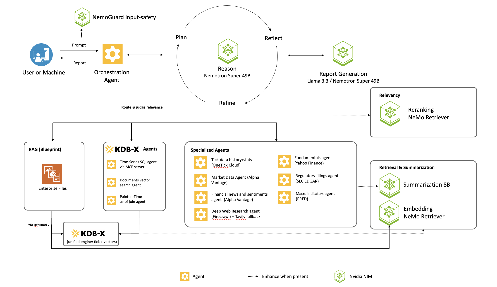

# NVIDIA AI Trading Agents Blueprint

## Overview

The **AI Trading Agents Blueprint** is an on-premise, multi-agent system for financial research and trading decision support. It pairs **KDB+/q** — for low-latency access to real-time and historical market data (prices, volumes, and time-series analytics, via MCP) — with a set of specialized **data-source agents** that pull external market intelligence: news and sentiment, web research, SEC filings, company fundamentals, and macroeconomic data.

At its core is an **orchestration layer** that turns a research question into a plan: a reasoning model proposes the queries, a registry classifies and routes each one to the source agent best suited to answer it, the agents execute **in parallel**, and a synthesis-and-reflection loop merges their findings into a comprehensive, **citation-backed report** with trading-relevant insights.

Built on the **NVIDIA NeMo Agent Toolkit** with NVIDIA NIM LLMs (Llama 3.3 Instruct for writing, Nemotron for reasoning), it runs entirely on your own infrastructure.

> **Lineage:** This blueprint is a modified derivative of the NVIDIA AI-Q Research Assistant blueprint (Apache-2.0). See [`NOTICE`](NOTICE) for attribution and [`docs/whats-different-from-aiq.md`](docs/whats-different-from-aiq.md) for what this variant adds.

## Table of Contents

- [NVIDIA AI Trading Agents Blueprint](#nvidia-ai-trading-agents-blueprint)
  - [Overview](#overview)
  - [Table of Contents](#table-of-contents)
  - [Key Features](#key-features)
  - [Source Agents](#source-agents)
  - [Quick Start](#quick-start)
  - [Target Audience](#target-audience)
  - [Software Components](#software-components)
  - [Technical Diagram](#technical-diagram)
  - [Minimum System Requirements](#minimum-system-requirements)
    - [Disk Space](#disk-space)
    - [OS Requirements](#os-requirements)
    - [Deploy Options](#deploy-options)
    - [Drivers](#drivers)
    - [Hardware Requirements](#hardware-requirements)
      - [Docker Compose](#docker-compose)
      - [Helm](#helm)
      - [Running with hosted NVIDIA NIM Microservices](#running-with-hosted-nvidia-nim-microservices)
    - [API Keys](#api-keys)
  - [Next Steps](#next-steps)
  - [License](#license)
  - [Security Considerations](#security-considerations)

## Key Features

- **Deep Research Loop**: Given a topic and desired report structure, the orchestrator (1) **plans** research queries, (2) **routes** each query to the best source agent and **judges** result relevance, (3) **reflects** to find gaps and re-queries, and (4) **writes** a citation-backed report. The reasoning model (Nemotron Super 49B) plans and reflects; the instruct model (Llama 3.3 70B) writes.
- **Multi-Agent Source Fleet (11 agents)**: A source-agent registry classifies each query and routes it — by planner tag, keyword, or semantic similarity — to the best-fit agent, running them **in parallel**. Results pass a **relevancy gate** (a NeMo Retriever reranker NIM, or an LLM judge); on a miss the orchestrator **reroutes** to fallback sources and finally a web search.
- **KDB-X — one engine, three capabilities**: The KX time-series engine backs three agents in a single runtime — **`kdb`** (time-series SQL via the MCP server), **`kdb_docs`** (GPU vector search over filings/documents, cuVS/CAGRA), and **`kdb_pit`** (point-in-time *as-of* joins matching trades to the prevailing quote). Tick data **and** RAG document vectors live in the same KDB-X instance.
- **Human-in-the-loop**: Feedback on the plan, interactive report edits, and follow-up Q&A on the final report. An in-app **agent picker** lets users enable agents and choose their data (RAG collection, KDB-X document collection, KDB-X tables) inline.
- **Document & Web Intelligence**: The NVIDIA RAG blueprint searches multimodal documents (text, charts, tables); specialized agents add market data, news/sentiment, fundamentals, SEC filings, macro indicators, OneTick tick history, and deep web research.
- **Enhance-when-present NIMs**: Optional NeMo Retriever embedding/reranking, a small summarization NIM, and NemoGuard content-safety activate automatically when configured and fall back gracefully when absent.
- **Demo Web Application**: A React frontend showcasing end-to-end use of AI Trading Agents.

## Source Agents

The orchestrator routes each planned query to one of **11 source agents** (plus a synthetic `web` fallback). Each agent reports an availability state (`available` / `needs_key` / `unavailable`) surfaced in the UI agent picker via `GET /source_agents`; agents light up only when their dependencies (endpoints, API keys, data, or a selected collection) are present.

| Agent | Source | Enabled by |
|-------|--------|------------|
| `rag` | Documents — multimodal vector search (NVIDIA RAG blueprint) | RAG server reachable |
| `kdb` | KDB-X time-series SQL via the MCP server | `KDB_ENABLED` + MCP endpoint |
| `kdb_docs` | KDB-X document vector search (filings/docs, GPU cuVS/CAGRA) | KDB-X host + selected collection + embedding NIM |
| `kdb_pit` | KDB-X point-in-time *as-of* join (trade ↔ prevailing quote) | KDB-X host + trade/quote tick data loaded |
| `onetick` | OneTick Cloud tick history | `ONETICK_CLIENT_ID` / `ONETICK_CLIENT_SECRET` |
| `web_search` | Deep web research (Firecrawl, Tavily fallback) | `FIRECRAWL_API_KEY` or `TAVILY_API_KEY` |
| `market_data` | Price/volume market data | `ALPHAVANTAGE_API_KEY` |
| `news_headlines` | News & sentiment headlines | `ALPHAVANTAGE_API_KEY` |
| `fundamentals` | Company fundamentals | Yahoo Finance (no key) |
| `sec_filings` | SEC EDGAR filings | `SEC_EDGAR_EMAIL` (identity, not a secret) |
| `macro_economic` | Macroeconomic indicators | `FRED_API_KEY` |

Selections that gate an agent (RAG collection, the KDB-X document collection, and the visible KDB-X tables) are chosen inline in the picker and persisted via `PUT /settings/kdb-docs` and `PUT /settings/kdb-tables`. SEC filings can be ingested into per-ticker RAG collections via `POST /sec/ingest`. See [docs/rest-api.md](docs/rest-api.md) and [docs/kdb-docs-agent.md](docs/kdb-docs-agent.md).

## Quick Start

This repository ships the **source + Helm charts + Docker Compose files**. Build the backend and frontend images from the included Dockerfiles, push them to your container registry, and point the deployment at them.

### Build the images

```bash
# Backend (FastAPI service) and frontend (React app)
docker build -f deploy/Dockerfile   -t <your-registry>/kxta-backend:latest  .
docker build -f frontend/Dockerfile -t <your-registry>/kxta-frontend:latest ./frontend

docker push <your-registry>/kxta-backend:latest
docker push <your-registry>/kxta-frontend:latest
```

Then point the deployment at your images: set `KXTA_BACKEND_IMAGE` / `KXTA_FRONTEND_IMAGE` for Docker Compose, or `image.repository` / `frontend.image.repository` (and `imagePullSecret`) for Helm.

> **Note:** The KDB-X database and MCP server are deployed separately. See the [KDB-X Deployment Guide](docs/kxta-deployment-guide.md) for full deployment instructions.

### Option A: Docker Compose (Single Server)

Deploy on a single server with Docker Compose. Ideal for development or when reusing existing NVIDIA RAG NIMs:

```bash
# 1. Set environment variables (add to ~/.bashrc for persistence)
export NVIDIA_API_KEY="nvapi-xxx"
export NGC_API_KEY="$NVIDIA_API_KEY"
export KDB_BEARER_TOKEN="your-kx-portal-token"      # From https://portal.kx.com
export KDB_LICENSE_B64="$(cat kc.lic | base64)"     # Your KDB license

# 2. Clone and deploy
git clone https://github.com/KxSystems/nvidia-kx-samples.git
cd nvidia-kx-samples/nvidia-kx-trading-agents

# If reusing existing NVIDIA RAG NIMs:
docker compose -f deploy/compose/docker-compose-kx-reuse-nim.yaml up -d

# Or for full local deployment with self-hosted NIMs:
docker compose -f deploy/compose/docker-compose-kx-local.yaml up -d

# 3. Access the frontend at http://localhost:3000
```

### Option B: Kubernetes (Helm)

Deploy on any Kubernetes cluster:

```bash
# 1. Deploy KDB-X MCP Server
helm upgrade --install kdb-mcp deploy/helm/kdb-x-mcp-server -n kxta --create-namespace \
  -f deploy/helm/kdb-x-mcp-server/examples/internal-runtime-values.yaml

# 2. Deploy AI Trading Agents (backend + frontend) — point image.repository at your registry
helm upgrade --install kxta deploy/helm/kxta -n kxta \
  -f deploy/helm/kxta/examples/values-generic-k8s.yaml \
  --set image.repository="<your-registry>/kxta-backend" \
  --set frontend.image.repository="<your-registry>/kxta-frontend" \
  --set imagePullSecret.registry="<your-registry>" \
  --set imagePullSecret.username="<registry-user>" \
  --set imagePullSecret.password="<registry-token>" \
  --set ngcApiSecret.password="$NVIDIA_API_KEY"

# 3. Access the frontend
kubectl -n kxta port-forward svc/kxta-frontend 3000:3000
# Open http://localhost:3000
```

> **Registry Credentials:** Replace `<your-registry>` and the `imagePullSecret` values with the registry you pushed the built images to.

### Supported Platforms

| Type | Distributions |
|------|---------------|
| Cloud | AWS EKS, Google GKE, Azure AKS, DigitalOcean |
| Self-hosted | kubeadm, k3s, RKE2, OpenShift |
| Local | minikube, kind, Docker Desktop |

### Configuration Examples

| Use Case | Values File |
|----------|-------------|
| **Default** | [`values.yaml`](deploy/helm/kxta/values.yaml) - set `image.repository` to your registry |
| Generic Kubernetes | [`values-generic-k8s.yaml`](deploy/helm/kxta/examples/values-generic-k8s.yaml) |
| Hybrid Cloud + On-Prem | [`values-hybrid.yaml`](deploy/helm/kxta/examples/values-hybrid.yaml) |
| Private registry | [`values-private-registry.yaml`](deploy/helm/kxta/examples/values-private-registry.yaml) |
| Custom deployment | [`values-custom.yaml`](deploy/helm/kxta/examples/values-custom.yaml) - Template with placeholders |

For detailed deployment instructions, see the [KDB-X Deployment Guide](docs/kxta-deployment-guide.md).

## Target Audience

- *Research Analysts:* This blueprint can be deployed by IT organizations to provide an on-premise deep research application for analysts
- *Financial Analysts:* Query time-series financial data using natural language, generate research reports with real-time market data
- *Developers:* This blueprint serves as a reference architecture for teams to adapt to their own AI research applications  

## Software Components

The AI Trading Agents blueprint provides these components:

- **Demo Frontend**: A docker container with a fully functional demo web application is provided. This web application is deployed by default if you follow the getting started guides and is the easiest way to quickly experiment with deep research using internal data sources via the NVIDA RAG blueprint. The source code for this demo web application is not distributed.
- **Backend Service via RESTful API**: The main AI Trading Agents code is distributed as the `kxta` Python package located in the `/kxta` directory. These backend functions are available directly or via a RESTful API.
- **Middleware Proxy**: An nginx proxy is deployed as part of the getting started guides. This proxy enables frontend web applications to interact with a single backend service. In turn, the proxy routes requests between the NVIDIA RAG blueprint services and the AI Trading Agents service.
- **KDB-X MCP Server**: A Model Context Protocol server that bridges the agents with the KDB-X engine for time-series SQL. The same KDB-X instance also serves document vectors (for `kdb_docs`) and point-in-time as-of joins (for `kdb_pit`) — one engine for tick data and RAG vectors. See [KDB-X MCP Server Helm Chart](deploy/helm/kdb-x-mcp-server/).

Additionally, the blueprint uses these components:

- [**NVIDIA NeMo Agent Toolkit**](https://github.com/NVIDIA/NeMo-Agent-Toolkit)
  Provides a toolkit for managing a LangGraph codebase. Provides observability, API services and documentation, and easy configuration of different LLMs.
- [**NVIDIA RAG Blueprint**](https://github.com/KxSystems/nvidia-kx-samples/tree/main/KX-nvidia-rag-blueprint)
  Provides a solution for querying large sets of on-premise multi-modal documents.
- [**NVIDIA NeMo Retriever Microservices**](https://developer.nvidia.com/nemo-retriever?sortBy=developer_learning_library%2Fsort%2Ffeatured_in.nemo_retriever%3Adesc%2Ctitle%3Aasc&hitsPerPage=12)
- [**NVIDIA NIM Microservices**](https://developer.nvidia.com/nim?sortBy=developer_learning_library%2Fsort%2Ffeatured_in.nim%3Adesc%2Ctitle%3Aasc&hitsPerPage=12) 
  Used through the RAG blueprint for multi-modal document ingestion.
  Provides the foundational LLMs used for report writing and reasoning, including the llama-3_3-nemotron-super-49b-v1_5 reasoning model.
- [**Web search powered by Tavily**](https://tavily.com/)
  Supplements on-premise sources with real-time web search.
- [**KDB-X by KX Systems**](https://kx.com/)
  High-performance time-series database for financial data. Requires KX Portal credentials for installation.

## Technical Diagram  


  <p align="center">
  
  </p>
## Minimum System Requirements 

### Disk Space

250 GB minimum

### OS Requirements

Ubuntu 22.04

### Deploy Options

| Option | Description | Guide |
|--------|-------------|-------|
| Docker Compose | Local development with GPU | [Get Started](docs/get-started/get-started-docker-compose.md) |
| NVIDIA AI Workbench | Managed environment | [README](deploy/workbench/README.md#get-started) |
| Helm | Kubernetes | [Get Started](docs/get-started/get-started-helm.md) |
| **KDB-X (Docker Compose)** | KDB+ on single server | [KDB-X Guide](docs/kxta-deployment-guide.md#docker-compose-deployment) |
| **KDB-X (Helm)** | KDB+ on Kubernetes | [KDB-X Guide](docs/kxta-deployment-guide.md) |

### Drivers

NVIDIA Container ToolKit  
GPU Driver -  530.30.02 or later  
CUDA version - 12.6 or later

> **Note:** Mixed MIG support in Helm deployment requires GPU operator 25.3.2 or higher and GPU Driver 570.172.08 or higher.

### Hardware Requirements

The following are the hardware requiremnts for running all services locally using Docker Compose and Helm Chart deployment.

#### Docker Compose

Use | Service(s)| Recommended GPU* 
--- | --- | --- 
Nemo Retriever Microservices for multi-modal document ingest | `graphic-elements`, `table-structure`, `paddle-ocr`, `nv-ingest`, `embedqa` | 1 x H100 80GB*  <br /> 1 x A100 80GB <br /> 1 x B200 <br /> 1 x RTX PRO 6000
Reasoning Model for Report Generation and RAG Q&A Retrieval | `llama-3_3-nemotron-super-49b-v1_5` with a FP8 profile  | 1 x H100 80 GB* <br /> 2 x A100 80GB <br /> 2 x B200 <br /> 1 x RTX PRO 6000
Instruct Model for Report Generation | `llama-3.3-70b-instruct` | 2 x H100 80GB* <br /> 4 x A100 80GB <br /> 2 x B200 <br /> 2 x RTX PRO 6000
**Total** | Entire AI Trading Agents Blueprint | 4 x H100 80GB* <br /> 7 x A100 80GB <br /> 5 x B200 <br /> 4 x RTX PRO 6000

  *This recommendation is based off of the configuration used to test the blueprint. For alternative configurations, view the [RAG blueprint documentation](https://github.com/KxSystems/nvidia-kx-samples/blob/main/KX-nvidia-rag-blueprint/docs/support-matrix.md).

#### Helm

| Option | RAG Deployment | AI Trading Agents Deployment | Total Hardware Requirement |
|--------|----------------|-----------------|---------------------------|
| Single Node - MIG Sharing | [Use MIG sharing](https://github.com/KxSystems/nvidia-kx-samples/blob/main/KX-nvidia-rag-blueprint/docs/mig-deployment.md) | [Default Deployment](#option-b-kubernetes-helm) | 4 x H100 80GB for RAG<br/>2 x H100 80GB for AI Trading Agents<br/> |
| Multi Node | [Default Deployment](https://github.com/KxSystems/nvidia-kx-samples/blob/main/KX-nvidia-rag-blueprint/docs/deploy-helm.md) | [Default Deployment](#option-b-kubernetes-helm) | 8 x H100 80GB for RAG<br/>2 x H100 80GB for AI Trading Agents<br/>---<br/>9 x A100 80GB for RAG<br/>4 x A100 80GB for AI Trading Agents<br/>---<br/>9 x B200 for RAG<br/>2 x B200 for AI Trading Agents<br/>---<br/>8 x RTX PRO 6000 for RAG<br/>2 x RTX PRO 6000 for AI Trading Agents|


#### Running with hosted NVIDIA NIM Microservices

This blueprint can be run entirely with hosted NVIDIA NIM Microservices, see [https://build.nvidia.com/](https://build.nvidia.com/) for details.


### API Keys & Credentials

- NVIDIA AI Enterprise developer licence required to local host NVIDIA NIM Microservices.
- NVIDIA [API catalog](https://build.nvidia.com/) or [NGC](https://org.ngc.nvidia.com/setup/personal-keys) API Keys for container download and access to hosted NVIDIA NIM Microservices
- [TAVILY API Key](https://tavily.com) for optional web search

**KDB-X Additional Requirements:**
- [KX Portal](https://portal.kx.com) Bearer Token - for KDB-X installation
- KDB-X License (kc.lic) - Base64-encoded for Kubernetes deployment


## Next Steps

- Use the [Get Started Notebook](notebooks/get_started_nvidia_api.ipynb) to deploy the blueprint with Docker and interact with the sample web application
- Deploy with [Docker Compose](docs/get-started/get-started-docker-compose.md) or [Helm](docs/get-started/get-started-helm.md)
- **Deploy with KDB-X** for financial data integration using the [KDB-X Deployment Guide](docs/kxta-deployment-guide.md)
- Customize the research assistant starting with the [Local Development Guide](docs/local-development.md)  

## License

This project will download and install additional third-party open source software projects. Review the license terms of these open source projects before use, found in [License-3rd-party.txt](LICENSE-3rd-party.txt). 

GOVERNING TERMS: AIQ blueprint software and materials are governed by the [Apache License, Version 2.0](https://www.apache.org/licenses/LICENSE-2.0), and: (a) the models, other than the Llama-3.3-Nemotron-Super-49B-v1 model, are governed by the [NVIDIA Community Model License](https://www.nvidia.com/en-us/agreements/enterprise-software/nvidia-community-models-license/); (b) the Llama-3.3-Nemotron-Super-49B-v1 model is governed by the [NVIDIA Open Model License Agreement](https://developer.download.nvidia.com/licenses/nvidia-open-model-license-agreement-june-2024.pdf), and (c) the NeMo Retriever extraction is released under the [Apache-2.0 license](https://github.com/NVIDIA/nv-ingest/blob/main/LICENSE).

ADDITIONAL INFORMATION: For NVIDIA Retrieval QA Llama 3.2 1B Reranking v2 model, NeMo Retriever Graphic Elements v1 model, and NVIDIA Retrieval QA Llama 3.2 1B Embedding v2: [Llama 3.2 Community License Agreement](https://www.llama.com/llama3_2/license/), Built with Llama. For Llama-3.3-70b-Instruct model, [Llama 3.3 Community License Agreement](https://www.llama.com/llama3_3/license/), Built with Llama.

**KDB-X ADDITIONAL TERMS**: This edition includes KDB+ and PyKX components from [KX Systems, Inc.](https://kx.com):
- **KDB-X**: Subject to the [KX Software License Agreement](https://kx.com/license/). Requires a valid KX license obtained from [KX Portal](https://portal.kx.com).
- **PyKX**: Licensed under the [PyKX License](https://code.kx.com/pykx/license.html). Personal/non-commercial use requires registration at KX Portal.
- **KDB-X MCP Server**: Released under [Apache-2.0 license](https://github.com/KxSystems/kdb-x-mcp-server/blob/main/LICENSE).

Users must obtain appropriate KX licenses before deploying in production. Contact [KX Sales](https://kx.com/contact/) for commercial licensing.

## Security Considerations

- **Prompt Content Filtering**: The AI Trading Agents includes input validation that detects and blocks user prompts containing suspicious text patterns (e.g., "ignore all instructions", "DROP TABLE", "eval()", etc.). This helps reduce the risk of prompt injection but does not provide protection against SQL injection, code execution, or XSS—those require proper security controls at the database, application, and output layers respectively. See [Prompt Content Filtering Tests](docs/security-testing.md) for basic testing examples.
- The AI Trading Agents Blueprint doesn't generate any code that may require sandboxing.
- The AI Trading Agents Blueprint is shared as a reference and is provided "as is". The security in the production environment is the responsibility of the end users deploying it. When deploying in a production environment, please have security experts review any potential risks and threats; define the trust boundaries, implement logging and monitoring capabilities, secure the communication channels, integrate AuthN & AuthZ with appropriate access controls, keep the deployment up to date, ensure the containers/source code are secure and free of known vulnerabilities.
- A frontend that handles AuthN & AuthZ should be in place as missing AuthN & AuthZ could provide ungated access to customer models if directly exposed to e.g. the internet, resulting in either cost to the customer, resource exhaustion, or denial of service.
- The AI Trading Agents doesn't require any privileged access to the system.
- The end users are responsible for ensuring the availability of their deployment.
- The end users are responsible for building the container images and keeping them up to date.
- The end users are responsible for ensuring that OSS packages used by the developer blueprint are current.
- The logs from nginx proxy, backend, and demo app are printed to standard out. They can include input prompts and output completions for development purposes. The end users are advised to handle logging securely and avoid information leakage for production use cases.
