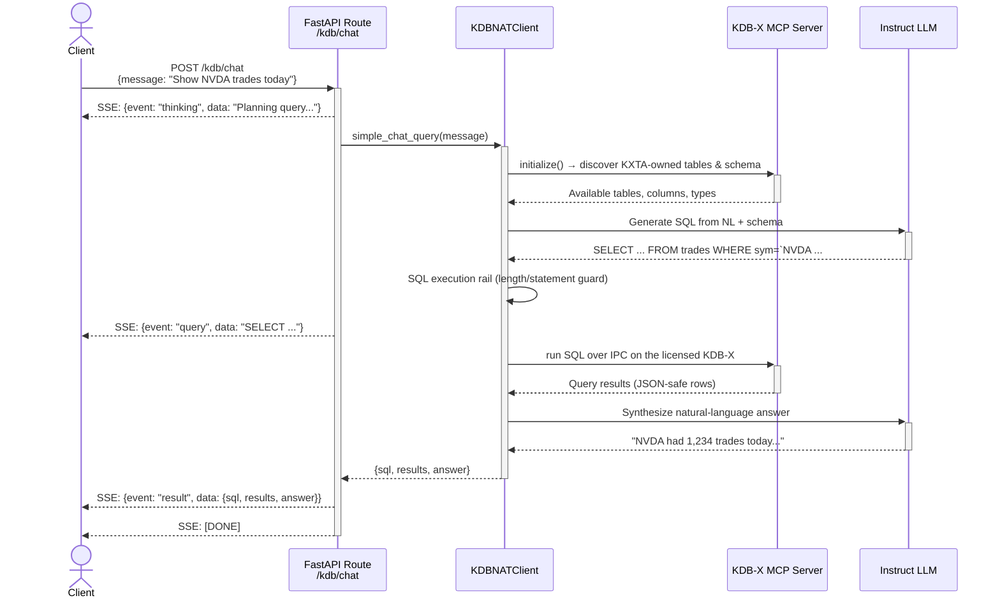
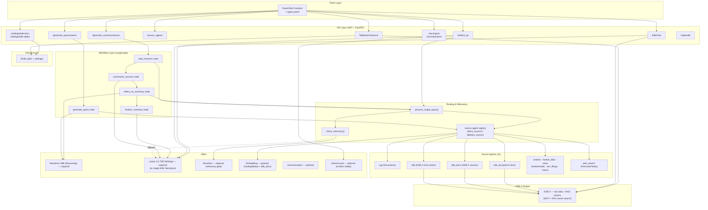

# AI Trading Agents — Sequence Diagrams

These diagrams describe the runtime flow of the orchestration loop:
**Plan → Route → Reflect → Write**. The three public endpoints
(`/generate_query`, `/generate_summary`, `/artifact_qa`) are unchanged from the
upstream blueprint, but inside `generate_summary` each query is now routed
through a **source-agent registry** (11 agents) rather than a fixed KDB+RAG
branch.

## Full System Sequence Diagram

```mermaid
sequenceDiagram
    actor User as Client (Frontend)
    participant FE as FastAPI / NAT Frontend
    participant GQ as generate_queries_fn()
    participant GQNode as generate_query node
    participant NemotronLLM as Nemotron 49B (Reasoning)
    participant GS as generate_summary_fn()
    participant WR as web_research node
    participant PSQ as process_single_query()
    participant REG as Source-Agent Registry
    participant SRC as Source Agents<br/>(rag, kdb, kdb_docs, kdb_pit,<br/>onetick, market_data, news,<br/>fundamentals, sec, macro)
    participant REL as check_relevancy()
    participant RR as Reranker NIM / LLM judge
    participant Tavily as Web Search (Firecrawl/Tavily)
    participant SS as summarize_sources node
    participant InstructLLM as Llama 3.3 70B (Instruct)
    participant RS as reflect_on_summary node
    participant FS as finalize_summary node
    participant AQ as artifact_qa_fn()

    %% ═══════════════════════════════════════════
    %% STAGE 1: GENERATE QUERIES (PLAN)
    %% ═══════════════════════════════════════════
    rect rgb(40, 60, 100)
    Note over User, NemotronLLM: Stage 1 — Plan: Generate Research Queries
    User->>+FE: POST /generate_query/stream<br/>{topic, report_organization, num_queries, enabled sources}
    FE->>+GQ: invoke generate_queries_fn()
    GQ->>+GQNode: astream(AIRAState, config)
    GQNode->>REG: registry.describe_for_planner(enabled)
    REG-->>GQNode: per-source hints + routing rules
    GQNode->>GQNode: build_data_sources_section()<br/>(tells planner which sources are available)
    GQNode->>+NemotronLLM: chain.astream(query_writer_instructions)
    NemotronLLM-->>GQNode: <think>reasoning tokens...</think>
    GQNode-->>User: SSE: {generating_questions: "thinking..."}
    NemotronLLM-->>-GQNode: JSON [{query, report_section, rationale, source}, ...]
    GQNode->>GQNode: parse + validate → GeneratedQuery[]<br/>sanitize_prompt(); each query tagged with a preferred source
    GQNode-->>-GQ: {queries: GeneratedQuery[]}
    GQ-->>-FE: GenerateQueryStateOutput
    FE-->>-User: SSE: {queries: [...]}
    end

    %% ═══════════════════════════════════════════
    %% STAGE 2: GENERATE SUMMARY (ROUTE → REFLECT → WRITE)
    %% ═══════════════════════════════════════════
    rect rgb(30, 80, 50)
    Note over User, Tavily: Stage 2 — Research Report

    User->>+FE: POST /generate_summary/stream<br/>{topic, queries[], rag_collection, reflection_count, search_web}
    FE->>+GS: invoke generate_summary_fn()
    GS->>GS: Build LangGraph:<br/>START → web_research → summarize_sources<br/>→ reflect_on_summary → finalize_summary → END

    %% --- Node 1: web_research (ROUTE) ---
    rect rgb(50, 90, 60)
    Note over WR, Tavily: Node 1: web_research — route each query to source agents (in parallel)
    GS->>+WR: astream(AIRAState, config)
    WR->>WR: Initialize Scratchpad() for audit trail

    par For each query (asyncio.gather)
        WR->>+PSQ: process_single_query(query, preferred_source)
        PSQ->>+REG: enabled_sources(configurable)
        REG-->>-PSQ: enabled agents (availability-gated)
        PSQ->>PSQ: select_sources(): planner tag → keyword<br/>→ semantic route (embedding NIM) if only RAG floor
        PSQ->>+SRC: run chosen agent(s) concurrently
        SRC-->>-PSQ: SourceResult[] (content, citation, record_count, duration)
        PSQ-->>WR: SSE: {"<source>_answer": "[duration, N records] ..."}
        loop For each SourceResult
            PSQ->>+REL: check_relevancy(query, content)
            REL->>RR: reranker NIM (1B forward pass) — or LLM judge if unconfigured
            RR-->>REL: score yes/no (logit ≥ threshold)
            REL-->>-PSQ: is_relevant
        end
        alt No usable result (empty or all irrelevant)
            PSQ->>PSQ: fallback_sources() — next-best, bounded to 2
            PSQ->>+SRC: re-dispatch to fallback agent(s)
            SRC-->>-PSQ: SourceResult[]
            PSQ->>REL: re-score relevancy
        end
        alt Still not relevant AND search_web=true
            PSQ->>+Tavily: web search (Firecrawl, Tavily fallback)
            Tavily-->>-PSQ: [{url, content, score}]
        end
        PSQ->>PSQ: merge_source_results() → answer + citation
        PSQ-->>-WR: (answer, citation, relevancy, web_answer, web_citation)
    end

    WR->>WR: deduplicate_and_format_sources() → XML
    WR-->>-GS: {citations, web_research_results: [xml]}
    end

    %% --- Node 2: summarize_sources (WRITE) ---
    rect rgb(60, 70, 90)
    Note over SS, InstructLLM: Node 2: summarize_sources — write initial report
    GS->>+SS: invoke summarize_sources node
    SS->>+InstructLLM: chain.astream(sources_xml + summarizer_instructions)
    InstructLLM-->>-SS: Markdown report draft (<think> stripped)
    SS-->>-GS: {running_summary: markdown_report}
    SS-->>User: SSE: {summarize_sources: "report chunk..."}
    end

    %% --- Node 3: reflect_on_summary (REFLECT) ---
    rect rgb(80, 60, 50)
    Note over RS, Tavily: Node 3: reflect_on_summary — supervisor digest + gap-filling loops
    GS->>+RS: invoke reflect_on_summary node
    RS->>RS: digest findings across sources (supervisor mode)
    loop For each reflection (up to reflection_count)
        RS->>+NemotronLLM: reflection_instructions {running_summary, previous_queries}
        NemotronLLM-->>-RS: {query: "follow-up query"}
        RS->>RS: is_query_novel()? (semantic/Jaccard dedup)
        alt Query is novel
            RS->>+PSQ: process_single_query(follow_up_query)
            Note over PSQ, Tavily: Same route → score → reroute → web flow
            PSQ-->>-RS: (answer, citation, relevancy, web_ans, web_cite)
            RS->>+InstructLLM: report_extender {running_summary + new_sources}
            InstructLLM-->>-RS: Extended report
            RS->>RS: Early-stop if growth < max(100 chars, 5%)
        end
    end
    RS-->>-GS: {running_summary, citations}
    RS-->>User: SSE: {reflect_on_summary: "..."}
    end

    %% --- Node 4: finalize_summary ---
    rect rgb(70, 50, 80)
    Note over FS, InstructLLM: Node 4: finalize_summary — clean + cite
    GS->>+FS: invoke finalize_summary node
    FS->>+InstructLLM: finalize_report {report + report_organization}
    InstructLLM-->>-FS: Cleaned final report (<think> stripped)
    FS->>FS: Append "## Sources" + formatted citations
    FS-->>-GS: {final_report, citations}
    end

    GS-->>-FE: GenerateSummaryStateOutput
    FE-->>-User: SSE: {final_report: "...", citations: "..."}
    end

    %% ═══════════════════════════════════════════
    %% STAGE 3: ARTIFACT Q&A
    %% ═══════════════════════════════════════════
    rect rgb(90, 50, 40)
    Note over User, InstructLLM: Stage 3 — Artifact Q&A / Report Editing
    User->>+FE: POST /artifact_qa<br/>{artifact, question, chat_history, use_internet, rewrite_mode, rag_collection}
    FE->>+AQ: invoke artifact_qa_fn()
    opt KXTA_APPLY_GUARDRAIL set
        AQ->>AQ: input rail (LLM relevancy gate or NemoGuard content-safety)
    end
    alt Needs supplementary search
        AQ->>+PSQ: process_single_query(question)
        Note over PSQ, Tavily: Same route → score → reroute → web flow
        PSQ-->>-AQ: (answer, citation, relevancy, web_ans, web_cite)
    end
    alt rewrite_mode == ENTIRE
        AQ->>+InstructLLM: UPDATE_ENTIRE_ARTIFACT_PROMPT {artifact, instructions}
        InstructLLM-->>-AQ: Rewritten report
    else Q&A Mode
        AQ->>+InstructLLM: llm.astream([artifact_context, chat_history..., question])
        InstructLLM-->>-AQ: Response text (<think> stripped)
    end
    AQ-->>-FE: ArtifactQAOutput
    FE-->>-User: {assistant_reply, updated_artifact}
    end
```

## KDB Chat Sequence (Standalone)



## Component Architecture Overview


